# 01 Assignment - Static testing 

## Description 

JTimeSched is a lightweight time tracking tool which allows the user to track the time of tasks and projects.
With its simple GUI, JTimeSched only provides the essential features for tracking the time spent on specific tasks, including the ability to create and delete tasks and to track the elapsed time on the current day and the overall elapsed time. Additionally, it allows the user to categorize the tasks and sort them by title, category, date created, time overall, time today, or current state and to add a description to each task.

This open-source maven-based project has the following structure: 
```
.
├── assets
├── conf (generated upon build)
├── dist
├── launcher
├── pom.xml
├── src
└── target
```

- The `launcher` folder contains the files to execute the program; 
- The `src` folder contains the source code of the application, which will be explained in more detail next; 
- The `dist` folder contains a script to generate the project distribution; 
- The `conf` folder is generated upon build and stores the serialized tasks and data of the application.

### Source code 
The source code is organized in three main folders: 

- `gui`: responsible for rendering the application; 
- `misc`: contains some utils code, namely a class containing one function to format date time; 
- `project`: contains the classes required to represent a task/project and to format their time.

It also includes the application's entry class: `JTimeSchedApp`.

## What is static testing and why is it relevant? 

Static testing is a type of verification, in other words, it is used to detect if a software has faults by analyzing the static system representation e.g. the source code; without actually executing it.

Static testing can be categorized in **manual examination** and **automated analysis**. The manual examination consists in analyzing the code manually by doing reviews, while the automated analysis uses tools to automate the process. 

There are four main reasons for testing an application: 
- To improve the client satisfaction;
- To increase the software quality; 
- To improve the security;
- There's a certain cost-benefit, since fixing faults earlier costs less than finding them later. 

The static verification, by itself, provides the following advantages:
- Detect warnings early, which might prevent some faults;  
- Detect faults before executing; 
- Improves the maintainability of the code. Some tools, such as `Checkstyle` improve the maintainability, by standardizing the style of the code;
- Detect dependencies and some inconsistencies. 

## Static Testing tools, reports and bugs addressed

### [SpotBugs](https://spotbugs.github.io/)

#### Description

SpotBugs is a static testing tool that can be used to find bugs in Java programs. It is able to detect multiple [bug patterns](https://spotbugs.readthedocs.io/en/latest/bugDescriptions.html), from bad coding practices to performance or security problems.

#### Configuration

To understand if the tool needed extra configuration, we first executed it with the default settings. 
After analyzing the report, we've decided not to add further configurations, since, from our point of view, the default rules and configuration were appropriate for our project, and no extra filtering was necessary.

#### Report

The [initial report](reports/spotbugs/spotbugs_01.pdf) produced by SpotBugs identifies 32 bugs and 0 errors. We can also verify that all the bugs reported belong to the classes of the project and gui directories or to the main class of the application. All the reported bugs have medium priority. We can verify that the bugs have different categories: `MALICIOUS_CODE`, `BAD_PRACTICE`, `EXPERIMENTAL`, `PERFORMANCE`, `STYLE` and `CORRECTNESS`.

Most of them are true bugs that should be addressed, even though they are only of medium priority. 

#### Bugs Found

**1) BAD_PRACTICE :: RV_RETURN_VALUE_IGNORED_BAD_PRACTICE**

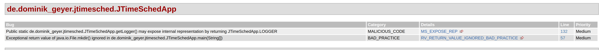

A `BAD_PRACTICE` was reported in the main method of the `JTimeSchedApp` class, suggesting that the method returns a value that is not checked.

Originally, the return value of the `mkDir()` call that creates the `conf` folder was not verified, as we can see in the following code snippet: 
```java
    if (!dirConf.isDirectory()) 
        dirConf.mkdir();
```

The code was modified so that the returned value, which indicates if the directory was successfully created or not, was checked and handled correctly. Now, if it isn't possible to create the `conf` folder, we exit the program, since it is necessary to persist the application's data and the failure to create the directory limits that requirement. 

```java
Boolean directoryCreated = false; 
if (!dirConf.isDirectory()) {
    directoryCreated = dirConf.mkdir();
    if (!directoryCreated){
        System.err.println("Not able to create directory");
        System.exit(1); 
    }
}
```

By changing the code has indicated above, the bug was fixed and, as we can see in the [new SpotBugs report](reports/spotbugs/spotbugs_02.pdf) the number of reported bugs changed from 32 to 31.
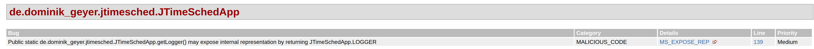

**2) STYLE :: SF_SWITCH_NO_DEFAULT**

A `STYLE` bug was reported in a switch case of the `TimeSchedTableMouseListener` inner class of the `JTimeSchedFrame` class, as we can see below:

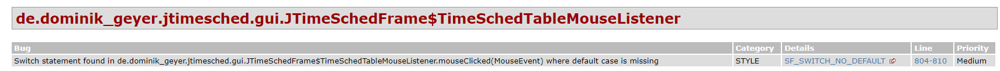

The code was written as follows: 
```java
switch (column) {
    case ProjectTableModel.COLUMN_ACTION_DELETE:
        if (e.getClickCount() == 2)
            handleDelete(tstm, prj, row);
        break;
    case ProjectTableModel.COLUMN_ACTION_STARTPAUSE:
        handleStartPause(prj);
        break;
    }
```

The `SF_SWITCH_NO_DEFAULT` complains about the missing default condition in the code. The code was modified to satisfy this condition: 
```java
switch (column) {
    case ProjectTableModel.COLUMN_ACTION_DELETE:
        if (e.getClickCount() == 2)
            handleDelete(tstm, prj, row);
        break;
    case ProjectTableModel.COLUMN_ACTION_STARTPAUSE:
        handleStartPause(prj);
        break;
    default: 
        break;
}
```

This resulted in a [new report](reports/spotbugs/spotbugs_03.pdf),  but the number of reported bugs kept the same because new similar bugs were reported in the same file. As we can see below, the bug no longer shows in the report, but another bug in a switch case of the same file is reported.


**3) PERFORMANCE :: DM_NUMBER_CTOR**

Another bug detected by this tool was related to `PERFORMANCE`. It indicated that in the `ProjectSerializer` an inefficient Integer constructor was being used, as we can see below:

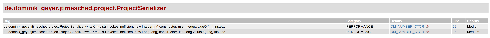

The code that led to this bug was written as follows:
```java
tf.setAttribute("indent-number", new Integer(4));
```

This code was modified in order to get a better performance. The constructor has actually been deprecated given that it is rarely appropriate to use it. As suggested in the documentation: ["The static factory valueOf(int) is generally a better choice, as it is likely to yield significantly better space and time performance"](https://docs.oracle.com/javase/9/docs/api/java/lang/Integer.html#Integer-int-); and that's the reason why we decided to use `Integer.valueOf()` instead:
```java
tf.setAttribute("indent-number", Integer.valueOf(4));
```
Similar modifications were performed for all the cases where the Integer or Long constructors were used.
For the same reason, when the Boolean constructor was used, it was modified from `new Boolean(true)` to `Boolean.TRUE` and from `new Boolean(false)` to `Boolean.FALSE`.

The [new report](reports/spotbugs/spotbugs_04.pdf) shows that the number of reported bugs was reduced to 27. Also, the bug reported was successfully fixed.

**4) MALICIOUS_CODE :: EI_EXPOSE_REP2** 

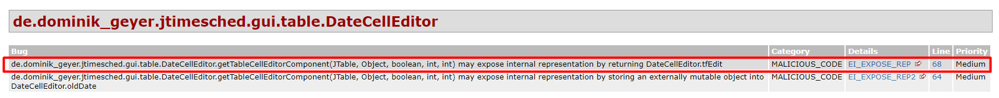

The code was written as follows: 
```java 
@Override
public Component getTableCellEditorComponent(JTable table,
        Object value, boolean isSelected, int row, int column) {
    this.oldDate = (Date)value;
    String strDate = ProjectTime.formatDate(this.oldDate);
    this.tfEdit.setText(strDate);
    
    return this.tfEdit;
}
```

The value returned is a reference to a mutable object. According to the [documentation](https://spotbugs.readthedocs.io/en/latest/bugDescriptions.html#EI_EXPOSE_REP2): 
> Returning a reference to a mutable object value stored in one of the object's fields exposes the internal representation of the object.  

The code was modified so that a copy of the `tfEdit` is returned. The field is copied by a new function called : 
```java
@Override
public Component getTableCellEditorComponent(JTable table,
        Object value, boolean isSelected, int row, int column) {
    this.oldDate = (Date)value;
    String strDate = ProjectTime.formatDate(this.oldDate);
    this.tfEdit.setText(strDate);

    return this.getTfEditCopy();
}

public Component getTfEditCopy(){
    // Returns a copy of the object, to not expose data. 
    JTextField tfEditCopy = (JTextField) this.getComponent();
    tfEditCopy.setHorizontalAlignment(SwingConstants.CENTER);
    tfEditCopy.setText(this.tfEdit.getText());
    return tfEditCopy;
}
```

As a result, the number of bugs reported was reduced to 26, as we can see in the [new report](reports/spotbugs/spotbugs_05.pdf), and the bug no longer shows on the report:
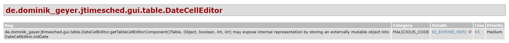

**5) BAD_PRACTICE :: DM_EXIT** 

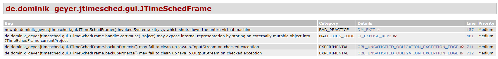

Previously the code was written as such: 
```java 
// load project-file
try {
    this.loadProjects();
} catch (FileNotFoundException e) {
    JTimeSchedApp.getLogger().info("Projects file does not exist, starting with empty projects file.");
} catch (Exception e) {
    e.printStackTrace();
    JTimeSchedApp.getLogger().severe("Error loading projects file: " + e.getMessage());
    
    JOptionPane.showMessageDialog(this,
            "An error occurred while loading the projects file.\n" +
            "Details: \"" + e.getMessage() + "\"\n\n" +
            "Please correct or remove the file '" + JTimeSchedApp.PRJ_FILE + "' " +
            "(or replace it with the backup file '" + JTimeSchedApp.PRJ_FILE_BACKUP + "', if present).\n\n" +
            "JTimeSched will quit now to avoid data corruption.",
            "Error loading projects file",
            JOptionPane.ERROR_MESSAGE);
    System.exit(1);
}
```

This code contains a line with `System.exit(1)`. This is considered bad practice by the SpotBugs, since it shuts down the entire machine code and not only the application. In an application with a server side, it will shut down the whole server, which might be hosting other critical Java applications. In web applications it might cause memory leaks.  


The code was rewritten to throw an exception: 

```java
// load project-file
try {
    this.loadProjects();
} catch (FileNotFoundException e) {
    JTimeSchedApp.getLogger().info("Projects file does not exist, starting with empty projects file.");
} catch (Exception e) {
    e.printStackTrace();
    JTimeSchedApp.getLogger().severe("Error loading projects file: " + e.getMessage());
    
    JOptionPane.showMessageDialog(this,
            "An error occurred while loading the projects file.\n" +
            "Details: \"" + e.getMessage() + "\"\n\n" +
            "Please correct or remove the file '" + JTimeSchedApp.PRJ_FILE + "' " +
            "(or replace it with the backup file '" + JTimeSchedApp.PRJ_FILE_BACKUP + "', if present).\n\n" +
            "JTimeSched will quit now to avoid data corruption.",
            "Error loading projects file",
            JOptionPane.ERROR_MESSAGE);
    
    throw new RuntimeException("Error loading projects file: " + e.getMessage()); 
}
```

This way, the program will finish with an Exception and, consequently, the bug no longer shows in the [new SpotBugs report](reports/spotbugs/spotbugs_06.pdf), which now only identifies 25 bugs.

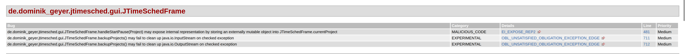

### [PMD](https://pmd.github.io/)

#### Description
PMD is a static source code analyzer that detects common programming flaws. It includes many built-in rules for different languages, such as [Java](https://pmd.sourceforge.io/pmd-6.49.0/pmd_rules_java.html) and also supports the creation of new rules. It is normally integrated in the build process and provides a tool to detect duplicated code - the CPD or "copy-paste-detector".

#### Report 

The [initial PMD report](reports/pmd/pmd_01.pdf) identifies many violations, mainly with priority 3 and 4, and one with priority 1. 
Some examples are: `EmptyCatchBlock`, `ControlStatementBraces`, `LiteralsFirstInComparisons`. 
The violations found and analyzed are true positives.   
One might think that some violations such as `ControlStatementBraces` are false positives, but this is rather a noise. The tool correctly identified the violation, however these are irrelevant to us. 
Therefore, we've modified the configurations to exclude these cases.

#### Configuration
The basic rulesets were gathered from the [pmd maven official website](https://maven.apache.org/plugins/maven-pmd-plugin/examples/usingRuleSets.html).   
The `pmd-quickstart.xml` rule set was obtained from the [pmd github page](https://github.com/pmd/pmd/blob/master/pmd-java/src/main/resources/rulesets/java/quickstart.xml). The following rules were commented in the `pmd-quickstart.xml` file: 

```xml 
<rule ref="category/java/codestyle.xml/UselessParentheses"/>
<rule ref="category/java/codestyle.xml/ControlStatementBraces"/>
<rule ref="category/java/documentation.xml/UncommentedEmptyMethodBody"/>
```

The following lines explains the motivation behind this configuration. 

- `UselessParentheses`: This rule throws a warning whenever useless parentheses are used in a statement. Although the parentheses don't modify the code behavior, we believe that, in some cases, it might helps other developers to understand the code, by making the scope more explicit. 
- `ControlStatementBraces`: The tool recommends to use braces even in scenarios where it isn't mandatory. Such as: 
```java
if (something)
	do something...
```
From our point of view, this is a subjective scenario: some people might prefer not to use braces to keep the code clean, while others may prefer using it to keep consistency.
Since this violation is a matter of perspective, we agreed to comment this rule. 

- `UncommentedEmptyMethodBody`: The commented method bodies are the overridden ones. The super class might implement the method, and there's no desired behavior for the function. Thus, we considered that the empty body is necessary and for this reason, the rule was commented. 

#### Bugs Found

**1) Design - [ClassWithOnlyPrivateConstructorsShouldBeFinal](https://pmd.sourceforge.io/pmd-6.49.0/pmd_rules_java_design.html#classwithonlyprivateconstructorsshouldbefinal)**

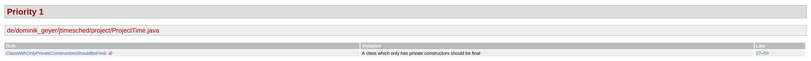

`ProjectTime` is a class that is only used to format and parse the time, therefore it only uses private constructors and static methods. For this reason, it should be final.

The original code was the following:
```java
public class ProjectTime {
	private static final String fmtDate = "yyyy-MM-dd";
	
	private ProjectTime() {}
	
	public static String formatSeconds(int s) {
		return String.format("%d:%02d:%02d", s/3600, (s%3600)/60, (s%60));
	}
    ...
}
```

And we made the class final, which resulted in the following code:
```java
public final class ProjectTime {
	private static final String fmtDate = "yyyy-MM-dd";
	
	private ProjectTime() {}
	
	public static String formatSeconds(int s) {
		return String.format("%d:%02d:%02d", s/3600, (s%3600)/60, (s%60));
	}
    ...
}
```

By doing this the [new report](reports/pmd/pmd_02.pdf) no longer shows violations with priority 1.

**2) Error Prone - [UseEqualsToCompareStrings](https://pmd.sourceforge.io/pmd-6.49.0/pmd_rules_java_errorprone.html#useequalstocomparestrings)**

In Java, Strings are actually Objects and, therefore, should be compared with the `equals()` method. While `equals()`compares the actual values of the Strings, the `==` operator only compares the references. For this reason, PMD reports the violation "Use equals() to compare Strings instead of '=='" that is shown below.

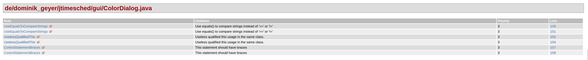

To fix it, the `==` in the original code snippet was replaced with the use of `equals()`.

The original code was the following:
```java
	@Override
	public void actionPerformed(ActionEvent e) {
		JButton btn = (JButton) e.getSource();
		
		if (e.getActionCommand() == NOCOLOR) {
			this.selectedColor = null;
		} else if (e.getActionCommand() == CHOOSER) {
			Color chosenColor = JColorChooser.showDialog(ColorDialog.this,
					"Choose a custom color",
					ColorDialog.this.currentColor);
			
			if (chosenColor != null)
				this.selectedColor = chosenColor;
			else
				this.selectedColor = this.currentColor;
		} else {
			this.selectedColor = btn.getBackground();
		}
		
		this.setVisible(false);
		this.dispose();
	}
```

Which was fixed by replacing the `==` with the use of `equals()`:
```java
	@Override
	public void actionPerformed(ActionEvent e) {
		JButton btn = (JButton) e.getSource();
		
		if (e.getActionCommand().equals(NOCOLOR)) {
			this.selectedColor = null;
		} else if (e.getActionCommand().equals(CHOOSER)) {
			Color chosenColor = JColorChooser.showDialog(ColorDialog.this,
					"Choose a custom color",
					ColorDialog.this.currentColor);
			
			if (chosenColor != null)
				this.selectedColor = chosenColor;
			else
				this.selectedColor = this.currentColor;
		} else {
			this.selectedColor = btn.getBackground();
		}
		
		this.setVisible(false);
		this.dispose();
	}
```

When fixing this error, a new violation was reported: `LiteralsFirstInComparisons`.
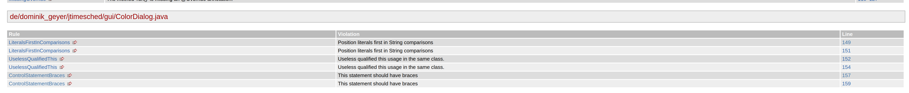

Literals should come first in all String comparisons to avoid the possibility of `NullPointerExceptions`. If the object that may be null is instead used as the parameter and the `equals()` is called in the literal, no exception will occur if the parameter is null, the method will just return false.

For this reason, we changed the code to the following:
```java
@Override
	public void actionPerformed(ActionEvent e) {
		JButton btn = (JButton) e.getSource();
		
		if (NOCOLOR.equals(e.getActionCommand())) {
			this.selectedColor = null;
		} else if (CHOOSER.equals(e.getActionCommand())) {
			Color chosenColor = JColorChooser.showDialog(ColorDialog.this,
					"Choose a custom color",
					ColorDialog.this.currentColor);
			
			if (chosenColor != null)
				this.selectedColor = chosenColor;
			else
				this.selectedColor = this.currentColor;
		} else {
			this.selectedColor = btn.getBackground();
		}
		
		this.setVisible(false);
		this.dispose();
	}
```

By doing this, we were able to successfully address the violation, as we can see in the [new PMD report](reports/pmd/pmd_03.pdf) and in the image below, where the `ColorDialog.java` file was reduced from 6 to 4. 

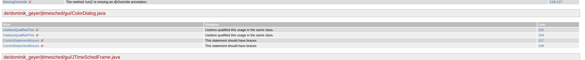

**3) Best Practice - [LooseCoupling](https://pmd.sourceforge.io/pmd-6.49.0/pmd_rules_java_bestpractices.html#loosecoupling)**

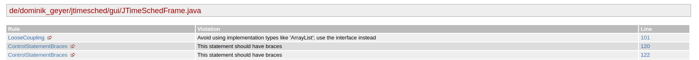

Components are loosely coupled if they are weakly associated, have little knowledge of each other and can easily be replaced with similar implementations.
In this specific case, using interface types, particularly the `List` interface, is recommended instead of using the implementation type, `ArrayList`, because that limits the possibility to use other implementations i.e. `LinkedList`. 
To fix this, we needed to change the type of the array of projects, `arPrj`, in the `JTimeSchedFrame` class and, given that this variable is used as a parameter of the `ProjectTableModel` constructor, we also changed the type of the argument of this constructor and the type of the attribute `arPrj` that this constructor initializes.

In the `JTimeSchedFrame` class, the original code was the following:
```java
private ArrayList<Project> arPrj = new ArrayList<Project>();
```

The code that resulted from the changes was the one below:
```java
private List<Project> arPrj = new ArrayList<Project>();
```

In the `ProjectTableModel` class the original code was this:
```java
	private ArrayList<Project> arPrj;
	
	public ProjectTableModel(ArrayList<Project> arPrj) {
		this.arPrj = arPrj;
	}
```

And we made the following changes:
```java
	private List<Project> arPrj;
	
	public ProjectTableModel(List<Project> arPrj) {
		this.arPrj = arPrj;
	}
```

By addressing this violation, the [new report](reports/pmd/pmd_04.pdf) now identifies doesn't report the violation anymore.
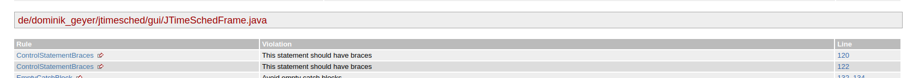

**4) [EmptyCatchBlock](https://metapx.org/java-ignore-exception/)**

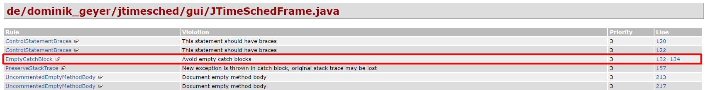

In order to ignore a specific exception, there was an empty catch block in the code: 

```java
// backup project-file
try {
	this.backupProjects();
} catch (FileNotFoundException e) {
	// ignore this exception: no project file -> no backup
} catch (Exception e) {
	e.printStackTrace();
	JTimeSchedApp.getLogger().warning("Unable to create backup of project file: " + e.getMessage());
}
```

In Java there isn't a particular syntax to ignore an exception like in Python. The way around this is indeed to use empty catch blocks. However, according to the `pmd`'s understanding, as this exception is an ignored one, the name of the exception's variable must be `ignored`. The rewritten code is the following: 

```java
// backup project-file
try {
	this.backupProjects();
} catch (FileNotFoundException ignored) {
	// ignore this exception: no project file -> no backup
} catch (Exception e) {
	e.printStackTrace();
	JTimeSchedApp.getLogger().warning("Unable to create backup of project file: " + e.getMessage());
}
```

The [new report](reports/pmd/pmd_05.pdf) and the image below show that the violation is no longer reported.
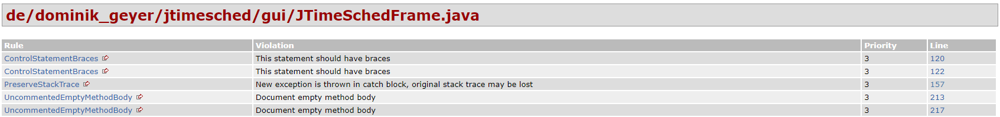

**5) [Simplified Ternary](https://pmd.sourceforge.io/pmd-6.49.0/pmd_rules_java_design.html#simplifiedternary)**

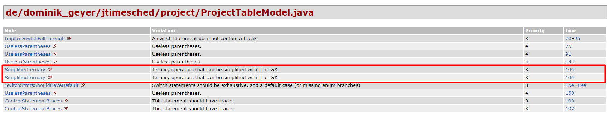

This violation identifies a statement that could be simplified. Previously the following code was written using a ternary:

```java
	@Override
	public boolean isCellEditable(int row, int column) {
		Project prj = this.getProjectAt(row);
		
		switch (column) {
		case ProjectTableModel.COLUMN_CHECK:
		case ProjectTableModel.COLUMN_TITLE:
		case ProjectTableModel.COLUMN_COLOR:
		case ProjectTableModel.COLUMN_CREATED:
			return true;
		case ProjectTableModel.COLUMN_TIMEOVERALL:
		case ProjectTableModel.COLUMN_TIMETODAY:
			// running tasks cannot be edited
			return (prj.isRunning() ? false : true);
		default:
			return false;	
		}
	}
```

The statement `prj.isRunning()` already returns a boolean, therefore the expression can be simplified to `return !prj.isRunning()`. With this change the code becomes cleaner and more efficient. The final code is the following: 

```java
	@Override
	public boolean isCellEditable(int row, int column) {
		Project prj = this.getProjectAt(row);
		
		switch (column) {
		case ProjectTableModel.COLUMN_CHECK:
		case ProjectTableModel.COLUMN_TITLE:
		case ProjectTableModel.COLUMN_COLOR:
		case ProjectTableModel.COLUMN_CREATED:
			return true;
		case ProjectTableModel.COLUMN_TIMEOVERALL:
		case ProjectTableModel.COLUMN_TIMETODAY:
			// running tasks cannot be edited
			return !prj.isRunning();
		default:
			return false;	
		}
	}
```
The [new report](reports/pmd/pmd_06.pdf) and the image below show that the file `ProjectTableModel.java`, which previously had 6 violations, now only has 4.
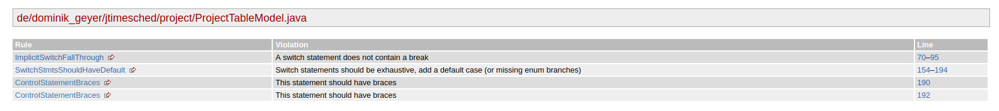

## Components 

- Diana Freitas :: up201806230
- Juliane Marubayashi :: up201800175 

## Resources 
- [Don't use system.exit](https://javarevisited.blogspot.com/2014/11/dont-use-systemexit-on-java-web-application.html#axzz7fypT4cYu)