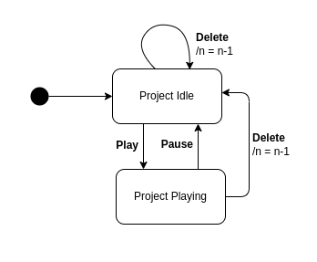

# Assignment 4 - Model-based Software Testing

## 1. Create project

JTimeSched's main goal is to allow users to track the time of certain projects. For that, the user must first create a "new project" and set its name, which allows him to distinguish between different tasks that he may want to track. For this reason, we decided to use `QF-Test` to perform Model-based testing on one of the simplest requirements of this tool, which is exactly to create a new project. 

### 1.1 State diagram
<!-- Maybe change new idle project state name -->

This diagram represents the creation of projects. Considering that the creation of the project triggers the edition of its title, we will also represent this part of the creation flow. However, we will not cover the case where the user updates a title of a project that was created in a previous interaction.

**Initial State**: In order to create a new project, no popup window can be opened in the application i.e. the user may not click the "Add Project" button while he is editing the quotas or changing the category of a project. For this reason, the initial state of this state machine is the `No Popup Opened` state.
**Transitions from `No Popup Opened`**: From the initial state, if the user presses the "Add Project" button, a new project with the default title of "New Project" will be created, thence the number of projects (`n`) is incremented by one (`n = n + 1`). The  new project will be in the idle state, that is, its counter is paused. 
**Transitions from `New Idle Project`**: After created i.e. when in the `New Idle Project` state; the user may change the default title of the project by typing at least one valid character or by deleting the default title from the input field, which is represented by the `Valid Keyboard Input` transition to the `Edit Title` state. On the other hand, the user may also decide to keep the default title, either by hitting "Enter", which will lead back to the `No Popup Opened` state, or by pressing the "Add Project" button, which will lead to the creation of yet another new project, represented by the `Create` self transition of the `New Idle Project` state.
**Transitions from `Edit Title`**: While the user is modifying the title of the project the state is kept in the same state. From there, the user may decide to discard his changes by pressing the "Esc" key or he may save his changes by clicking the "Enter" key, for example. Both this transitions will lead back to the `No Popup Opened` state. Instead, the user may decide to add a new project by pressing the "Add Project" button while he is editing the title. By doing so, the title changes will be saved and a new project will be created, which is represented by the `Save title & Create` transition that goes to the `New Idle Project` state.

### 1.2 Transition tree 

- We start with the initial state, named `No Popup Open`;
- From the initial state we only have an outgoing transition to `New Idle Project`, which results from the creation of a new project;
- From the `New Idle Project` state we have three outgoing edges to `No Popup Open`, `Edit Title` and `New Idle Project`. The only state where we haven't been before is the `Edit Title`. From this state the user may go to the `No Popup Open`, `Edit Title` or `New Idle Project`.

### 1.3 Transition table  

| States / Events | Create | Valid Keyboard input | Save title | Save title & create |   
| - | - | - | - | - | 
| No Popup Opened |  New Idle Project | | | | 
| New Idle Project | New Idle Project | Edit Title | No Popup Opened | | 
| Edit Title | | Edit Title | No Popup Opened | New Idle Project | 

### 1.4 Sneak Paths 

In the section **1.3** the empty cells corresponds to **sneak transitions**. 
Let's map the expected behavior of each **sneak transition**. 

| (State, Event) | Behavior | Explanation | 
| -------------- | -------- | ----------  | 
| (No Popup Opened, Valid Keyboard input) | | | 
| (No Popup Opened, Save title) | | | 
| (No Popup Opened, Save title & create) | | | 
| (New Idle Project, Save title & create ) | | | 
| (Edit Title, Create) | | | 

### 1.5 Tests developed in QF-Test tool

<!-- Dizer que notamos que o comportamente não é o esperado aquando da criação do 6º projeto-->

#### 1. Create project and save custom title

> `No Popup Opened` ->  `New Idle Project` -> `Edit title` -> `No Popup Opened` (com Save)

For the first test, we decided to combine the paths shown below in order to test the full flow of creating a project, setting a custom title and saving it. We need to make sure that the title of the new project is the one typed by the user.

For that, we used the "Setup" started by creating ...

#### 2. Create project and discard title changes

> `No Popup Opened` -> `New Idle Project` -> `Edit title` -> `No Popup Opened` (com Discard)

For the second test, we also combined the paths shown above, but this time we wanted to test the case where, after the user changes the title, he discards the changes by pressing the "Esc" key, for example. The final title of the new project should be "New Project", which is the default.

For that, ...

#### 3. Create two new projects consecutively

> `No Popup Opened` -> `New Idle Project` -> `Create` -> `New Idle Project`

Here we test the case where the user creates a project and, without making any changes to the default title, he presses the "Add project" button again. The first project should have the default name and a second project should be created.

For that, ...

#### 4. Create project and accept default title

> `No Popup Opened` -> `New Idle Project` -> `Create` -> `New Idle Project`

Here we test the case where the user creates a new project and accepts the default title by pressing "Enter", for example.

For that, ...

#### 5. Create a new project, change the title and create another project 

> `No Popup Opened` -> `New Idle Project` -> `Edit Title` -> `Create`

In this test we experiment the scenario in which the user creates a new project, changes the title of the project and, without hitting "Enter" to save the changes, he presses the "Add Project" button to add yet another project.
In this case we want to make sure that the title changes are made and that both projects are effectively created.

For that, ...

## 2. Edit time/quota today

JTimeSched's users are able to edit a project in multiple ways: they can change its title, color, creation date, time overall, time today, quota today, quota overall or update its notes. Considering there are many different requirements associated with the edition of a project, we decided to focus on the edition of time fields, which have some interesting peculiarities to consider, in particular, the fact that they don't allow changes to be made while the project is running. As the edit actions that can be accessed through the Time Overall and Time Today cells are very similar, we decided to focus only on the edit functionalities related to the Time Today, mainly the edition of the time spent on a project in the current day.

###  2.1 State diagram 

### 2.2 Transition tree

### 2.3 Transition table 
| States / Events   | Time Today Double Left Click | Save Valid Time Today | Save Invalid Time Today | Save Empty Time Today | Play | Pause |
|---|---|---|---|---|---|---|
| Project Idle      | Time Today Edition |  |  |  | Project Playing | |
| Project Playing   |  |  |  |  | | Project Idle|
| Time Today Edition|   | Project Idle | Project Idle | Project Idle | | |

### 2.4 Sneak Paths 

12 sneak paths

To test:
Project Playing -> Play
Time Today Edition -> Play

### 2.5 Tests developed in QF-Test tool 

## 3. Delete Project

###  3.1 State diagram 

### 3.2 Transition tree

### 3.3 Transition table 

### 3.4 Sneak Paths 

### 3.5 Tests developed in QF-Test tool 

## QF-Test tool feedback 

