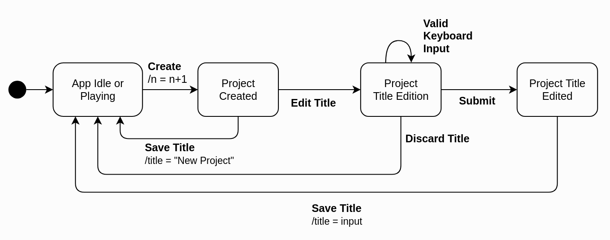
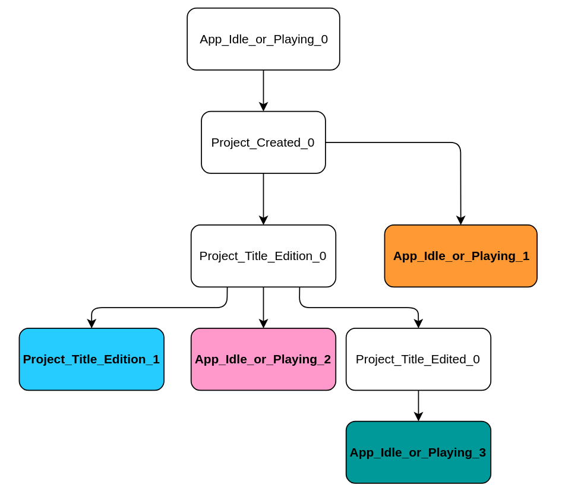
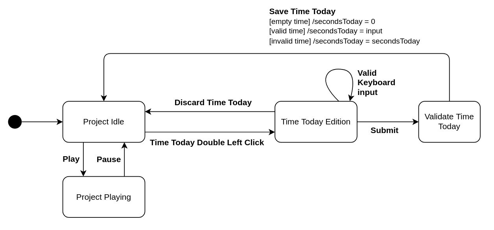

# Assignment 4 - Model-based Software Testing

## 1. Create project

JTimeSched's main goal is to allow users to track the time of certain projects. For that, the user must first create a "new project" and set its name, which allows him to distinguish between different tasks that he may want to track. For this reason, we decided to use `QF-Test` to perform Model-based testing on one of the simplest requirements of this tool, which is exactly to create a new project. 

### 1.1 State diagram
<!-- Maybe change new idle project state name -->

### 1.2 Transition tree 

### 1.3 Transition table  

| States / Events | Create | Valid Keyboard input | Save title | Save title & create |   
| - | - | - | - | - | 
| No Popup Opened |  New Idle Project | | | | 
| New Idle Project | New Idle Project | Edit Title | No Popup Opened | | 
| Edit Title | | Edit Title | No Popup Opened | New Idle Project | 

### 1.4 Sneak Paths 

In the section **1.3** the empty cells corresponds to **sneak transitions**. 
Let's map the expected behavior of each **sneak transition**. 

| (State, Event) | Behavior | Explanation | 
| -------------- | -------- | ----------  | 
| (No Popup Opened, Valid Keyboard input) | | | 
| (No Popup Opened, Save title) | | | 
| (No Popup Opened, Save title & create) | | | 
| (New Idle Project, Save title & create ) | | | 
| (Edit Title, Create) | | | 

### 1.5 Tests developed in QF-Test tool

## 2. Edit time/quota today

JTimeSched's users are able to edit a project in multiple ways: they can change its title, color, creation date, time overall, time today, quota today, quota overall or update its notes. Considering there are many different requirements associated with the edition of a project, we decided to focus on the edition of time fields, which have some interesting peculiarities to consider, in particular, the fact that they don't allow changes to be made while the project is running. As the edit actions that can be accessed through the Time Overall and Time Today cells are very similar, we decided to focus only on the edit functionalities related to the Time Today, mainly the edition of the time spent on a project in the current day.

##  2.1 State diagram 

## 2.2 Transition tree

## 2.3 Transition table 
| States / Events   | Time Today Double Left Click | Save Valid Time Today | Save Invalid Time Today | Save Empty Time Today | Play | Pause |
|---|---|---|---|---|---|---|
| Project Idle      | Time Today Edition |  |  |  | Project Playing | |
| Project Playing   |  |  |  |  | | Project Idle|
| Time Today Edition|   | Project Idle | Project Idle | Project Idle | | |

## 2.4 Sneak Paths 

12 sneak paths

To test:
Project Playing -> Play
Time Today Edition -> Play

## 2.5 Tests developed in QF-Test tool 

## 3. Delete Project

###  3.1 State diagram 

### 3.2 Transition tree

### 3.3 Transition table 

### 3.4 Sneak Paths 

### 3.5 Tests developed in QF-Test tool 

## QF-Test tool feedback 

