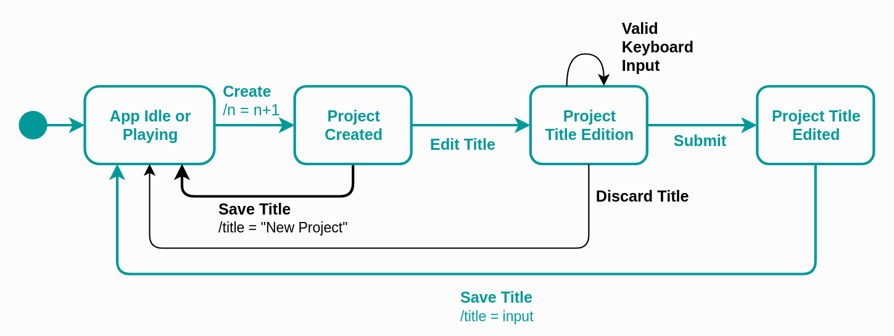
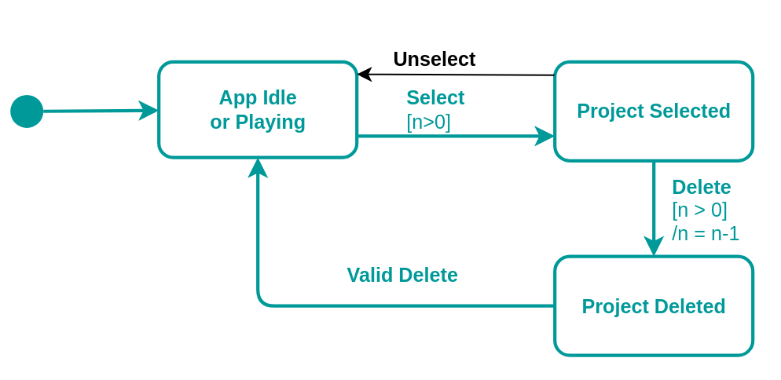

# Assignment 4 - Model-based Software Testing

## 1. Create project

JTimeSched's main goal is to allow users to track the time of certain projects. For that, the user must first create a "new project" and set its name, which allows him to distinguish between different tasks that he may want to track. For this reason, we decided to use `QF-Test` to perform Model-based testing on one of the simplest requirements of this tool, which is exactly to **create a new project**. 

### 1.1 State diagram

The diagram shown below represents the creation of projects. Given that the creation of a project triggers the edition of its title, we also represent this part of the creation flow in the diagram. However, we will not cover the case where the user updates a title by double clicking the title field, as it is not part of the "project creation" requirement.

**Initial State**: In order to create a new project, no popup window can be opened in the application i.e. the user may not click the "Add Project" button while he is editing the quotas or changing the category of a project. If that is the case, we consider that the App is "Idle". We consider that the App is "Playing" if no popup is opened but there is a project "playing". As we can only create a new project if the App is in any of these two states, our initial state is `App Idle or Playing`.
**Transitions from `App Idle or Playing`**: From the initial state, if the user presses the "Add Project" button, a new project with the default title of "New Project" will be created, thence the number of projects (`n`) is incremented by one (`n = n + 1`), as we can see in the action of the `Create` transition. This leads to a state where the new project will be in the idle state, that is, its counter is paused. 
**Transitions from `Project Created`**: After created i.e. when in the `Project Created` state; the user may edit the default title of the project - `Edit Title`; or he may decide to keep the default title, by pressing "Enter", for example, which will lead back to the initial state.
**Transitions from `Project Title Edition`**: While the user is modifying the title of the project, the state is kept in the `Project Title Edition`. From there, the user may decide to discard his changes by pressing the "Esc" key, or he may `Submit` his changes by clicking the "Enter" key, for example.
**Transitions from `Project Title Edited`**: After the user submits his input, the title of the new project is saved - `Save Title`; leading back to the initial state.

### 1.2 Transition tree 

- We start with the initial state, named `App Idle or Playing`;
- From the initial state, we only have an outgoing transition to `Project Created`, which results from the creation of a new project;
- From the `Created` state, we have two outgoing edges, one to `Project Title Edition` and another to `App Idle or Playing`. The only state where we haven't been before is the `Project Title Edition`. From this state, the user may go to the `Project Title Edition`, `App Idle or Playing` or `Project Title Edited`. Finally, from the `Project Title Edited` state, we can only go to the `App Idle or Playing` state.
From this tree, we can derive the test paths, which will be explored in the QF-Test tool and further explained in section 1.5: 
- `App Idle or Playing` -> `Project Created` -> `App Idle or Playing`
- `App Idle or Playing` -> `Project Created` -> `Project Title Edition` -> `App Idle or Playing`
- `App Idle or Playing` -> `Project Created` -> `Project Title Edition` -> `Project Title Edition`
- `App Idle or Playing` -> `Project Created` -> `Project Title Edition` -> `Project Title Edited` -> `App Idle or Playing`

### 1.3 Transition table  

| States / Events | Create | Edit Title | Submit | Valid Keyboard Input | Save Title | Discard Title |   
| - | - | - | - | - | - | - |
| App Idle or Playing |  Project Created ||||||
| Project Created || Project Title Edition ||| App Idle or Playing ||
| Project Title Edition ||| Project Title Edited | Project Title Edition || App Idle or Playing |
| Project Title Edited | | | | | App Idle or Playing || 

### 1.4 Sneak Paths 

In section **1.3**, the 17 empty cells correspond to **sneaky transitions**.
But only one was selected to be tested: 

1. (App Idle or Playing, Valid Keyboard Input)
 
We expect that the events that generate sneak paths in their respective states, generate a default behavior equivalent to nothing. For example, from the initial state (`App Idle or Playing`), it is clear that the `Edit Title`, `Save Title`, `Discard Title`, `Submit` and `Valid Keyboard Input` events are not expected to generate any change of state. For instance, if we type without selecting a specific input, nothing is expected to change in the App, but there is no need to throw an exception either. However, as we will see in section **1.5.4** this doesn't actually happen.

### 1.5 Tests developed in QF-Test tool

For the creation requirement we used the `Creation` test-set that can be found in the QF-Test test-suite, available in the qf-test directory.

**Requirements**: This test set assumes you have no previous configuration saved (no projects stored in memory). Please delete the `conf` folder before testing.

**Outcome**: All but one of the test-cases described below were successful. The outcome of the test that failed - **1.5.4** will be explained in detail in the respective section. Despite the success of the other tests, while building the test-set, we also tested a setup with which the tests failed due to a bug in the App. In particular, if we have 5 projects already created and we create a new one, the title of that project will not become automatically focused, just like it happens when we create the previous and next projects. We believe this happens because this is the first project that goes beyond the vertical space of the App (requires scroll).

#### 1.5.1. Create project and discard title changes

For the first test, we combined the paths shown below, to test the case where, after the user creates a project and edits its title, he discards the changes by pressing the "Esc" key, for example. The final title of the new project should be "New Project", which is the default.

The test case `01_create-and-discard-title` was the one used to test this scenario:
- It starts at the main window of the JTimeSched tool, after the App is launched, where, by default, there is no popup opened and the App is "Idle" - `App Idle or Playing` state. Considering that the requirements that we described above were respected, there are no projects in the App yet;
- Click "Add Project" (which represents the `Create` transition from `App Idle or Playing` to `Project Created`);
- Check if the project was created by verifying that there is only one project;
- Type "Project1" as the name of the project - `Project Title Edition`;
- Press "Esc" - `Discard title`;
- Check that the title was discarded by verifying that it was set to the default value - "New Project";
- Finally, a cleanup sequence was used to delete the newly created project.

The test passes with success.

#### 1.5.2 Create project and accept default title

Here we test the case where the user creates a new project and accepts the default title by pressing "Enter", for example.

The test case `02_create-and-enter` was the one used to test this scenario:
- It starts at the main window of the JTimeSched tool, after the App is launched, where, by default, there is no popup opened and the App is "Idle" - `App Idle or Playing` state. Considering that the requirements that we described above were respected, there are no projects in the App yet;
- Click "Add Project" (which represents the `Create` transition from `App Idle or Playing` to `Project Created`);
- Check if the project was created by verifying if the number of projects is one;
- Press "Enter" (`Save title` transition from `Project Created` to `App Idle or Playing`);
- Check that the name of the recently added project is the default - "New Project";
- Finally, a cleanup sequence was used to delete the newly created project.

The test passes with success.

#### 1.5.3 Create project and save custom title

For this test, we decided to combine the paths shown below, in order to test the full flow of creating a project, setting a custom title and saving it. We need to make sure that the title of the new project is the one typed by the user.

The test case `03_create_type_and_save` was the one used to test this scenario:
- It starts at the main window of the JTimeSched tool, after the App is launched, where, by default, there is no popup opened and the App is "Idle" - `App Idle or Playing` state. Considering that the requirements that we described above were respected, there are no projects in the App yet;
- Click "Add Project" (which represents the `Create` transition from `App Idle or Playing` to `Project Created`);
- Check if the project was created by verifying that there is only one project;
- Type "Project1" as the name of the project - `Project Title Edition`;
- Check if the input was changed to "Project1";
- Press "Enter" (`Save title` transition from `Project Title Edited` to `App Idle or Playing`);
- Check if the project title was changed to "Project1";
- Finally, a cleanup sequence was used to delete the newly created project.

The test passes with success.

#### 1.5.4. Sneak Path - (App Idle or Playing, Valid Keyboard input)  

In this sneak path, we want to **assess** that if the event  `Valid Keyboard Input` occurs, the application doesn't change its state. Changing the state by typing any key is not an intuitive behavior for the user unless this action is a shortcut that was documented. 

The test `04_sneak_path` was performed in the following way: 
- Firstly, we bring the App to the initial state;
- Then a project is created; 
- It's checked if the project was created with success in the `App Idle or Playing` State; 
- The "Enter" key is pressed to accept the default title of the project, which brings us back to the `App Idle or Playing` state;
- We induce a `Valid Keyboard Input` from this state; 
- Upon the input of a `Valid Keyboard input` **the test fails**, since it transits to the `Project Title Edition`. In other words, by clicking in any letter in the keyboard, or any `Valid Keyboard Input`, the edition of the project title is automatically started. 

As mentioned before, this behavior isn't desired, since it is not intuitive for the user, and might cause many undesired editions by accident. Furthermore we noticed that it is inconsistent - sometimes, if we click near other cells of the App, the `Valid Keyboard Input` will trigger the edition of other fields.

## 2. Edit time 

JTimeSched's users are able to edit a project in multiple ways: they can change its title, color, creation date, time overall, time today, quota today, quota overall or update its notes. Considering there are many different requirements associated with the edition of a project, we decided to focus on the edition of time fields, which have some interesting peculiarities to consider, in particular, the fact that they don't allow changes to be made while the project is running. As the edit actions for the `Time Overall` and `Time Today` of a project are very similar, we decided to focus only on the edit functionalities related to the `Time Today` field, mainly the edition of the time spent on a project in the current day.

###  2.1 State diagram 

> **Note 1**: The `Time Today` of a project can only be edited if that project is not "counting"/"playing". For that reason, we decided to include the play/pause use case in this state diagram, which will then allow us to show that the transition between the `Project Playing` and the `Edit Today` state is "sneaky".
> **Note 2**: The states of this diagram refer to states of a single project.

**Initial State**: To be able to edit the `Time Today` of a project, no popup window can be opened in the application and the project must not be "playing" - its timer must not be counting. We named this state `Project Idle`. From here, the user can edit the `Time Today` field by performing a double left click on the respective input field. This transition is clear in the diagram and leads to the `Time Today Edition` state. From the idle state, the user may also press the "Play" button and start the timer of the project.
**Transitions from `Time Today Edition`**: `Time Today Edition` represents the state where the `Time Today` field of the project is focused and the user is able to update it by typing the new value, a behavior represented by the `Valid Keyboard input` self transition. To save the new value, the user can press the "Enter" key, for example, which will lead to the `Validate Time Today` state. However, if the user presses the "Esc" key, his changes will be discarded - `Discard Time Today`.
**Transitions from `Validate Time Today`**: The input of the user is then validated and saved accordingly. If the user submits an empty value, the time will be set to 0. On the other hand, if the user submits a valid time, the field will be updated with that value. Finally, if the user inserts an invalid time, the `Time Today` will be kept the same. These cases represent the conditions and actions of the `Save Time Today` transition, which leads back to the `Project Idle` state.
**Transitions from `Project Playing`**: As we explained above, this diagram also includes the play/pause use case, to show that it is no possible to update the `Time Today` if the project is playing. In the scope of the edition of the `Time Today` field, which is the one we are portraying here, the only possible outgoing transition results from pressing the "Pause" button, which will lead back to the `Project Idle` state.

### 2.2 Transition tree

- We start with the initial state, `Project Idle`;
- From the initial state we only have two possible outgoing transitions, one to `Project Playing`, triggered by pressing the "Play" button of the respective project, and another to the `Time Today Edition` state, which is triggered by a double left click on the `Time Today ` field of the project;
- From the `Project Playing` state the only possible transition results from pressing the "Pause" button and leads back to the initial state, which was already explored;
- From the `Time Today Edition` state, we can go back to the `Project Idle` state if we discard the changes, we can keep in the `Time Today Edition` state, while we are inserting valid input in the field, or we can submit our input, which will lead to the `Validate Time Today` state;
- From the `Validate Time Today` state we can only go to the `Project Idle` state.
As we have already expanded every possible state, the transition tree is complete.
From this tree, we can derive the test paths, which will be explored in the QF-Test tool and further explained in section 2.5: 
- `Project Idle` -> `Project Playing` -> `Project Idle`
- `Project Idle` -> `Time Today Edition` -> `Project Idle`
- `Project Idle` -> `Time Today Edition` -> `Time Today Edition`
- `Project Idle` -> `Time Today Edition` -> `Validate Time Today` -> `Project Idle`

### 2.3 Transition table 
| States / Events   | Time Today Double Left Click | Save Time Today | Play | Pause | Discard Time Today | Valid Keyboard Input | Submit |
|---|---|---|---|---|---|---|---|
| Project Idle | Time Today Edition || Project Project Playing |||||
| Project Playing |||| Project Idle ||||
| Time Today Edition||||| Project Idle | Time Today Edition | Validate Time Today |
| Validate Time Today || Project Idle ||||||

### 2.4 Sneak Paths 

In total there are 21 sneak paths, but only two were selected to be tested:   

1. (Project Playing, Time Today Double Left Click)
2. (Time Today Edition, Time Today Double Left Click)

In the first sneak path, it must not be possible to edit the `Time Today` field while the project is playing. It is expected that the program remains in the same state.  
In the second case, if the user triggers the `Time Today Double Left Click`, the state must also remain the same.   

The tests developed for this "sneak paths" are explained in detail in sections 2.5.4 and 2.5.5.

### 2.5 Tests developed in QF-Test tool 

To test the "Edit Time Today" requirement, we used the `Time-Today-Edition` test-set that can be found in the QF-Test test-suite, available in the qf-test directory.

**Requirements**: This test set assumes you have no previous configuration saved (no projects stored in memory). Please delete the `conf` folder before testing.

**Outcome**: There is a total of 7 tests counting with the sneak paths. All of them pass with success.

#### 2.5.1. Play/Stop

As we explained above, the play/pause use case was also included here. With this test, we want to check that it is possible to play and pause a project when no popup windows are opened.

The test case `01_play_and_stop` was the one used to test this scenario:

- The setup brings the App to the `Project Idle` state, where there are no popups opened and there is already a project in the table with "0:00:00" time;
- Press the "Play" button;
- Press the "Pause" button after 4000ms (by setting the "Delay before" of the `stop` sequence);
- Check if the `Time Today` field changed to 4000ms, which allows us to check if the project was really in the `Project Playing` state for 4000ms and is now in the `Project Idle` state again;
- Finally, a cleanup sequence was used to delete the project that was used.

The test passes with success.

#### 2.5.2. Discard Time Today

Here we test the case where the user discards his input by pressing "Esc" to discard his changes. For that, we combine the two paths shown below.

The test case `02_edit-esc` was the one used to test this scenario:

- The setup brings the App to the `Project Idle` state, where there are no popups opened and there is already a project in the table with "0:00:00" time;
- Check the initial time of the project;
- Select the `Time Today` field - `Time Today Double Left Click` event; which brings the App to the `Time Today Edition` state;
- In the `Time Today Edition` state, type a valid time ("0:32:32");
- Verify if the value "0:32:32" is in the input field;
- Press "Esc" to discard the input - `Discard Time Today`;
- Check if the `Time Today` is the initial one ("0:00:00");
- Finally, a cleanup sequence was used to delete the project that was used.

The test passes with success.

#### 2.5.3. Save Time Today

These tests exercise the scenario in which the user updates the `Time Today` to a valid time i.e. a time that respects the regular expression "\d+:[0-5]?\d:[0-5]?\d"; an empty input or an invalid time. To test this, we combined the paths shown below.and created three different tests: one where the input is a valid time string (`03_1_edit_save`), another where the input is empty (`03_2_edit_save`) and a final one where the input is invalid (`03_3_edit_save`).

All the test cases follow a similar structure:

- The setup brings the App to the `Project Idle` state, where there are no popups opened and there is already a project in the table;
- Check the initial time of the project;
- Select the `Time Today` field - `Time Today Double Left Click` event; which brings the App to the `Time Today Edition` state;
- In the `Time Today Edition` state, depending on the test case, we write a valid, empty or invalid input;
- Verify the value of the input field;
- According to the test, verify if the time was correctly saved:
  - in the case of a valid input, check if the value is the one that was typed;
  - if the input was empty, check if the final time is "0:00:00";
  - if the input was invalid, check if the time is the initial one i.e. the time was not modified;
- Finally, a cleanup sequence was used to delete the project that was used.

The tests pass with success.

#### 2.5.4. (Sneak Path 1) Edit time today while playing

The test `04_sneak_path` was designed in the following way: 

- The application starts in the initial state, `Project Idle`; 
- Then the event `play` is triggered; 
- At this phase, the application is in the `Project Playing` state and, as shown in the state machine diagram, there isn't any transition from `Project Playing` that leads to `Time Today` edition; 
- However, the `Time Today Double Left Click` event is induced; 
- At this phase, it must be verified if the `TimeToday` box is in edit mode or not. By triggering this event, it's expected that no alterations are made in the state. 

The test passes with success. 

#### 2.5.5. (Sneak Path 2) 

The test `05_sneak_path` was designed in the following way: 

- The application starts in the initial state, `Project Idle`; 
- Then the user triggers the `Time Today Double Left Click` event and, therefore, the program transits to the `Time Today Edition`;  
- Once more, the user tries to trigger the `Time Today Double Left Click`, which implies that the user must perform a double click in the `Time Today` field once more; 
- It's expected that the application doesn't respond to the command remaining in the same state, since this is the most intuitive alternative in this context. 

The test passes with success.

## 3. Delete Project

As mentioned before, JTimeSched's main goal is to allow users to track the time of their projects. Apart from creating a project, to manage the software the user must also be able to delete it.   
The malfunctioning of the delete use case not only would cause chaos in the administration of information but would also compromise the program usage on the long term. For this reason, it's crucial to the the deletion of a project.  

###  3.1 State diagram   

This diagram shows the flow to delete a project in the system's perspective. 

- **Transitions from App Idle or Playing**: In this initial state, the software can be idle or not. The only action that it can perform is selecting a project. By "selecting a project" we mean that the project becomes highlighted in blue. It is only possible to select a project if the number of projects (`n`) is higher than zero, naturally.  
- **Transitions from Project Selected**: Once a project is selected, we can delete it. Even if a person tries to double-click the button to delete a project, this action automatically highlights it. In this state, it's possible to unselect the project using the mouse or using the arrows to change the selection. It's also feasible to delete a project. However, this action is only possible if the number of projects is higher than zero and after that, the number of projects is decremented by one. 
- **Transitions from Project Deleted**: This is a state of validation, where it's verified if the project was truly deleted. If it was, then the application returns to the initial state.  

### 3.2 Transition tree

 

- We start with the `App_Idle_or_Playing`, which  states that the app might be running the counter or not;  
- Then the only state available from `App_Idle_or_Playing` is `Project_Selected`; 
-  In `Project_Selected`, we have two options: `Project_Deleted` and `App_Idle_or_Playing`. Let's first analyse the `Project_Deleted` and then the `App_Idle_or_Playing`: 
    - After the project is deleted in `Project_Deleted`, the only available path is returning to the initial state (`Project_Idle_or_Playing`), which was already visited in the tree; 
    - The same goes for the other fork of `Project_Selected`, which is `App_Idle_or_Playing`. As in the previous case, since `App_Idle_or_Playing` was already processed, this is a leaf of the transition tree. 

### 3.3 Transition table 

| States / Events | Select | Unselect | Delete | Valid Delete |  
| - | - | - | - | - | 
| App Idle or Playing | Project Selected |  |  |  |  
| Project Selected | | App Idle or Playing | Project Deleted  | |
| Project Deleted | | | |App Idle or Playing |

### 3.4 Sneak Paths 
 
With this table we can see that there's a total of 8 sneak paths. 

We expect that the events that generate sneak paths in their respective states, generate a default behavior equivalent to nothing. For example, the sneak path `(Project Selected, Select)`, means that someone tried to select the same project. This action can be performed in many ways, but let's suppose that someone tries to select it once again. In this case, nothing should happen and the project must remain selected (highlighted in blue).  

However, a case that perhaps should display an error message is the `(App Idle or Playing, Delete)`. It would be wise to warn the user to select a project before trying to delete it. 

### 3.5 Tests developed in QF-Test tool 

To test the "Delete Project" requirement, we used the `Delete` test-set that can be found in the QF-Test test-suite, available in the qf-test directory.

**Requirements**: This test set assumes you have no previous configuration saved (no projects stored in memory). Please delete the `conf` folder before testing.

**Outcome**: W had planned to be perform two tests in this test-case. However, as explained in the test **3.5.2**, due to limitations associated with the Qf-test tool, it was not possible to test the situation where a project is selected and then unselected.  

#### 3.5.1 Delete a project  

The main goal of this test is to verify if all the phases related to the deletion of a project work accordingly.

The test is structured as follows:
- The initial state starts with the application being idle or playing - `App Idle or Playing`;
- If at least one project exists, the `select` event can be performed;
- After performing the previous step, the project becomes `selected`;
- Since it's not possible to verify if a project is selected or not using the QF-Tool, the validation of the `Project Selected` was discarded; 
- After the selection of the project, it can be `deleted`;
- This action leads to the `Project Deleted` state, where we must assess if the project was truly deleted. If it was, then the application returns to the initial state.  

#### 3.5.2 Select and unselect a project  
In this scenario, we just want to select and unselect a project. 

This test, however, was not performed. The QF-test tool was somehow an impediment: it wasn't possible to verify if a project was selected or not, since the color is the only aspect that characterizes a selection and the check of the QF-tool are mainly based on "textual" fields.  

## QF-Test tool feedback 

In general, the tool is really intuitive, however:
- It was hard to understand if a specific test passed. This information is only available near a small "plus" icon on the bottom right corner of the tool. It would be better to also have a message similar to the JUnit tool, that indicates if the test passed or failed in a clear way. This might not make difference to old users, but it would improve the experience for new users like us.
- The design is another point. It wouldn't make a difference to old customers that are already used to the tool, but improving the design would make more attractive.
- In our case, it was also difficult to create some of the checks. Particularly, the App that we were testing mainly consists of a table, and it was hard to select a particular cell of that table without accidentally selecting other parts of the table;
- If we include multiple sequences within the same test-case, it is difficult to understand in which of them the test failed;
- The checks are based on the text content of the inputs and text elements, but sometimes this is not enough. For instance, in our project, when a row is selected, its color changes. It would be useful to be able to capture this modification, as well as other visual modifications of the UI that are not text related.
