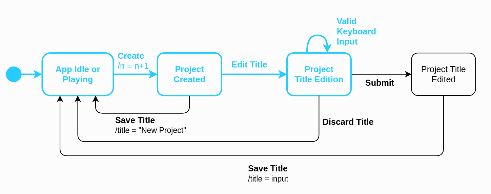
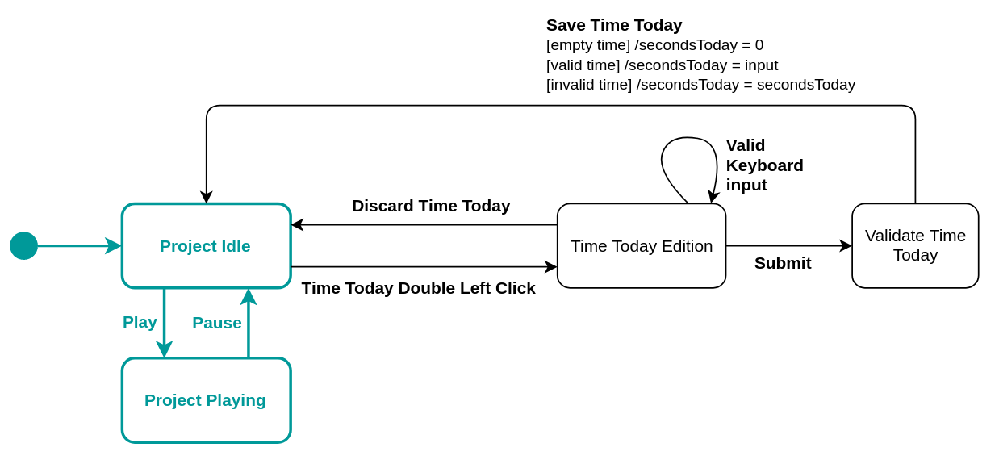
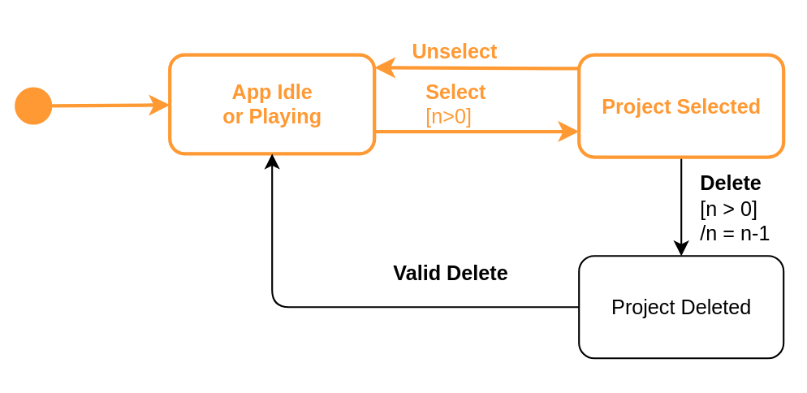

# Assignment 4 - Model-based Software Testing

## 1. Create project

JTimeSched's main goal is to allow users to track the time of certain projects. For that, the user must first create a "new project" and set its name, which allows him to distinguish between different tasks that he may want to track. For this reason, we decided to use `QF-Test` to perform Model-based testing on one of the simplest requirements of this tool, which is exactly to create a new project. 

### 1.1 State diagram

This diagram represents the creation of projects. Considering that the creation of the project triggers the edition of its title, we will also represent this part of the creation flow. However, we will not cover the case where the user updates a title of a project that was created in a previous interaction.

**Initial State**: In order to create a new project, no popup window can be opened in the application i.e. the user may not click the "Add Project" button while he is editing the quotas or changing the category of a project. For this reason, the initial state of this state machine is the `No Popup Opened` state.
**Transitions from `No Popup Opened`**: From the initial state, if the user presses the "Add Project" button, a new project with the default title of "New Project" will be created, thence the number of projects (`n`) is incremented by one (`n = n + 1`). The  new project will be in the idle state, that is, its counter is paused. 
**Transitions from `New Idle Project`**: After created i.e. when in the `New Idle Project` state; the user may change the default title of the project by typing at least one valid character or by deleting the default title from the input field, which is represented by the `Valid Keyboard Input` transition to the `Edit Title` state. On the other hand, the user may also decide to keep the default title, either by hitting "Enter", which will lead back to the `No Popup Opened` state, or by pressing the "Add Project" button, which will lead to the creation of yet another new project, represented by the `Create` self transition of the `New Idle Project` state.
**Transitions from `Edit Title`**: While the user is modifying the title of the project the state is kept in the same state. From there, the user may decide to discard his changes by pressing the "Esc" key or he may save his changes by clicking the "Enter" key, for example. Both this transitions will lead back to the `No Popup Opened` state. Instead, the user may decide to add a new project by pressing the "Add Project" button while he is editing the title. By doing so, the title changes will be saved and a new project will be created, which is represented by the `Save title & Create` transition that goes to the `New Idle Project` state.

### 1.2 Transition tree 

- We start with the initial state, named `No Popup Open`;
- From the initial state we only have an outgoing transition to `New Idle Project`, which results from the creation of a new project;
- From the `New Idle Project` state we have three outgoing edges to `No Popup Open`, `Edit Title` and `New Idle Project`. The only state where we haven't been before is the `Edit Title`. From this state the user may go to the `No Popup Open`, `Edit Title` or `New Idle Project`.
From this tree, we can derive the test paths, which will be explored in the QF-Test tool and further explained in section 1.5: 
- `No Popup Opened` -> `New Idle Project` -> `No Popup Opened`
- `No Popup Opened` -> `New Idle Project` -> `New Idle Project`
- `No Popup Opened` -> `New Idle Project` -> `Edit Title`
- `No Popup Opened` -> `New Idle Project` -> `Edit Title` -> `No Popup Opened`
- `No Popup Opened` -> `New Idle Project` -> `Edit Title` -> `New Idle Project`
- `No Popup Opened` -> `New Idle Project` -> `Edit Title` -> `Edit Title`

### 1.3 Transition table  

| States / Events | Create | Valid Keyboard input | Save title | Save title & create |   
| - | - | - | - | - | 
| No Popup Opened |  New Idle Project | | | | 
| New Idle Project | New Idle Project | Edit Title | No Popup Opened | | 
| Edit Title | | Edit Title | No Popup Opened | New Idle Project | 

### 1.4 Sneak Paths 

In the section **1.3** the 5 empty cells correspond to **sneak transitions**.
Let's map the expected behavior of each **sneak transition**. 

| (State, Event) | Behavior | Explanation | 
| -------------- | -------- | ----------  | 
| (No Popup Opened, Valid Keyboard input) | Nothing | If we type without selecting a specific input, nothing is expected to change in the App, but there is no need to throw an exception either | 
| (No Popup Opened, Save title) | Nothing | If the user doesn't create a project or explicitly selects a title to change, he will not be able to save anything, because there will be no input in title field to save. | 
| (No Popup Opened, Save title & create) | Nothing | Same as the case above | 
| (New Idle Project, Save title & create) | Nothing | Without typing or deleting the default title of a project, its value will not be modified, so saving a custom title from this state is not possible. | 
| (Edit Title, Create) | Nothing | If the user presses the "Add Project" button while he is editing the title, the current changes that he made to the title must be saved, and a new project will be created, which corresponds to the `Save title & create` transition. Therefore, there must not be a scenario where pressing the "Add project" button while editing the title doesn't first save the current changes. | 

### 1.5 Tests developed in QF-Test tool

**Requirements**: This test set assumes you have no previous configuration saved (no projects stored in memory). Please delete the `conf` folder before testing.

<!-- Dizer que notamos que o comportamente não é o esperado aquando da criação do 6º projeto-->
<!-- Brief description of the outcome of each test and whether any test results in a failure (and why). -->

#### 1.5.1 Create project and save custom title

For the first test, we decided to combine the paths shown below in order to test the full flow of creating a project, setting a custom title and saving it. We need to make sure that the title of the new project is the one typed by the user.

The test case `create-project` was the one used to test this scenario.
First, we recorded a sequence that represents all the states and transitions:
- The sequence starts at the main window of the JTimeSched tool, without any popup open - `No Popup Opened` state.
- Click "Add Project" (which represents the `Create` transition from `No Popup Opened` to `New Idle Project`);
- Type "Project1" has the name of the project (which represents both the transition from `New Idle Project` to `Edit title`, and the self transition of the `Edit title` state);
- Press "Enter" (`Save title` transition from `Edit title` to `No Popup Opened`);
Then, we recorded the sequence `Check project name`, a check that verifies if the name of the recently added project is effectively "Project1".
Another check (`Check number of projects`) was used to verify if the number of projects was one.
Finally, a cleanup sequence was used to delete the newly created project.

#### 1.5.2 Create project and accept default title

Here we test the case where the user creates a new project and accepts the default title by pressing "Enter", for example.

The test case `create-project-default` was the one used to test this scenario.
First, we recorded a sequence that represents all the states and transitions:
- The sequence starts at the main window of the JTimeSched tool, without any popup open - `No Popup Opened` state.
- Click "Add Project" (which represents the `Create` transition from `No Popup Opened` to `New Idle Project`);
- Press "Enter" (`Save title` transition from `New Idle Project` to `No Popup Opened`);
Then, we recorded the sequence `Check Project Name`, a check that verifies if the name of the recently added project is the default - "New Project".
Another check (`Check number of projects`) was used to verify if the number of projects was one.
Finally, a cleanup sequence was used to delete the newly created project.

#### 1.5.3. Create two new projects consecutively

Here we test the case where the user creates a project and, without making any changes to the default title, he presses the "Add project" button again. The first project should have the default name and a second project should be created.

The test case `create-project-add-project` was the one used to test this scenario.
First, we recorded a sequence that represents all the states and transitions:
- The sequence starts at the main window of the JTimeSched tool, without any popup open - `No Popup Opened` state.
- Click "Add Project" (which represents the `Create` transition from `No Popup Opened` to `New Idle Project`);
- Click "Add Project" again (which represents the `Create` self transition of the `New Idle Project` state);
- Press "Enter" (`Save title` transition from `New Idle Project` to `No Popup Opened`);
Then, we recorded the sequences `Check project name 1` and `Check project name 2`, which verify if the titles of both projects are the default - "New Project".
Another check (`Check number of projects`) was used to verify if the number of projects was two.
Finally, a cleanup sequence was used to delete both projects.

#### 1.5.4. Create project and discard title changes

For the second test, we combined the paths shown above, but this time we wanted to test the case where, after the user changes the title, he discards the changes by pressing the "Esc" key, for example. The final title of the new project should be "New Project", which is the default.

The test case `create-project-discard-name` was the one used to test this scenario.
First, we recorded a sequence that represents all the states and transitions:
- The sequence starts at the main window of the JTimeSched tool, without any popup open - `No Popup Opened` state.
- Click "Add Project" (which represents the `Create` transition from `No Popup Opened` to `New Idle Project`);
- Type "MyProject" has the name of the project (which represents both the transition from `New Idle Project` to `Edit title`, and the self transition of the `Edit title` state);
- Press "Enter" (`Save title` transition from `Edit title` to `No Popup Opened`);
Then, we recorded the sequence `Check project name`, a check that verifies if the name of the recently added project is "New project", meaning that the changes were discarded.
Another check (`Check number of projects`) was used to verify if the number of projects was one.
Finally, a cleanup sequence was used to delete the newly created project.

#### 1.5.5. Create a new project, change the title and create another project 

In this test we experiment the scenario in which the user creates a new project, changes the title of the project and, without hitting "Enter" to save the changes, he presses the "Add Project" button again to add yet another project.
In this case we want to make sure that the title changes are kept and that both projects are effectively created.

The test case `create-project-title-add-project` was the one used to test this scenario.
First, we recorded a sequence that represents all the states and transitions:
- The sequence starts at the main window of the JTimeSched tool, without any popup open - `No Popup Opened` state.
- Click "Add Project" (which represents the `Create` transition from `No Popup Opened` to `New Idle Project`);
- Type "MyProject" has the name of the project (which represents both the transition from `New Idle Project` to `Edit title`, and the self transition of the `Edit title` state);
- Press "Add Project" (`Save title & Create` transition from `Edit title` to `New Idle Project`);
The test case `create-project-discard-name` was the one used to test this scenario.
First, we recorded a sequence that represents all the states and transitions:
- The sequence starts at the main window of the JTimeSched tool, without any popup open - `No Popup Opened` state.
- Click "Add Project" (which represents the `Create` transition from `No Popup Opened` to `New Idle Project`);
- Type "MyProject" has the name of the project (which represents both the transition from `New Idle Project` to `Edit title`, and the self transition of the `Edit title` state);
- Press "Enter" (`Save title` transition from `New Idle Project` to `No Popup Opened`).
Then, we recorded the sequence `Check project name`, a check that verifies if the name of the recently added project is "New project", meaning that the changes were discarded.
Another check (`Check number of projects`) was used to verify if the number of projects was one.
Finally, a cleanup sequence was used to delete the newly created project.

Then, we recorded the sequences `Check project name 1` and `Check project name 2`, to check that the name of the first project was saved as "MyProject" and that the second kept the default title "New Project".
Another check (`Check number of projects`) was used to verify if the number of projects was two.
Finally, a cleanup sequence was used to delete both projects.

## 2. Edit time 

JTimeSched's users are able to edit a project in multiple ways: they can change its title, color, creation date, time overall, time today, quota today, quota overall or update its notes. Considering there are many different requirements associated with the edition of a project, we decided to focus on the edition of time fields, which have some interesting peculiarities to consider, in particular, the fact that they don't allow changes to be made while the project is running. As the edit actions for the `Time Overall` and `Time Today` of a project are very similar, we decided to focus only on the edit functionalities related to the `Time Today` field, mainly the edition of the time spent on a project in the current day.

###  2.1 State diagram 

> **Note 1**: The `Time Today` of a project can only be edited if that project is not "counting"/"playing". For that reason, we decided to include the play/pause use cases in this state diagram, which will then allow us to show that the transition between the `Project Playing` and the `Edit Today` state is "sneaky".
> **Note 2**: The states of this diagram refer to states of a single project.

**Initial State**: To be able to edit the `Time Today` of a project, no popup window can be opened in the application and the project must not be "playing" - its timer must not be counting. We named this state `Project Idle`. From here, the user can edit the `Time Today` field by performing a double left click on the respective input field. This transition is clear in the diagram and leads to the `Time Today Edition` state. From the idle state, the user may also press the "Play" button and start the timer of the project.
**Transitions from `Time Today Edition`**: `Time Today Edition` represents the state where the `Time Today` field of the project is focused and the user is able to update it by typing the new value, a behavior represented by the `Valid Keyboard input` self transition. To save the new value, the user can press the "Enter" key, for example. If the user submits an empty value, the time will be set to 0 and if the user submits a valid time, the field will be updated accordingly. This cases represent the conditions of the `Save Time Today` transition. However, if the user submits an invalid time or presses the "Esc" key, his changes will be discarded - `Discard Time Today`. When the input is saved or discarded, the project returns to the idle state.
**Transitions from `Project Playing`**: As we explained above, this diagram also includes the play/pause use case, to show that it is no possible to update the `Time Today` if the project is playing. In the scope of the edition of the `Time Today` field, which is the one we are portraying here, the only possible outgoing transition results from pressing the "Pause" button, which will lead back to the `Project Idle` state.

### 2.2 Transition tree

- We start with the initial state, `Project Idle`;
- From the initial state we only have two possible outgoing transitions, one to `Project Playing`, triggered by pressing the "Play" button of the respective project, and another to the `Time Today Edition` state, which is triggered by a double left click on the `Time Today ` field of the project.
- From the `Project Playing` state the only possible transition results from pressing the "Pause" button and leads back to the initial state, which was already explored. 
- From the `Time Today Edition` state, we can go back to the `Project Idle` state when we have finished editing, we can keep in the `Time Today Edition` state, while we are inserting valid input in the field, or we can press the "Play" button and simultaneously save the current input, if valid, and 
As we have already expanded every possible state, the transition tree is complete.
From this tree, we can derive the test paths, which will be explored in the QF-Test tool and further explained in section 2.5: 
- `Project Idle` -> `Project Playing` -> `Project Idle`
- `Project Idle` -> `Time Today Edition` -> `Project Idle`
- `Project Idle` -> `Time Today Edition` -> `Time Today Edition`
- `Project Idle` -> `Time Today Edition` -> `Project Playing`

### 2.3 Transition table 
| States / Events   | Time Today Double Left Click | Save Time Today | Play | Pause |
|---|---|---|---|---|---|---|
| Project Idle      | Time Today Edition | | Project Project Playing | |
| Project Playing   |  |  | | Idle |
| Time Today Edition|   |  | | |

### 2.4 Sneak Paths 

In total there are 12 sneak paths. But only two were selected to be tested:   

1. (Project Playing, Play)  
2. (Time Today Edition, Play)   

In the first sneak path, it's necessary to assess that if the project is playing: 
- The available button references the stop action.   
- By pressing the stop/play button, the project that is already running must stop.  

In the second action it's necessary to verify that if the project is running, then the "TimeToday" field can't be edited.  

### 2.5 Tests developed in QF-Test tool 

#### 1. Save Time Today

In these tests we exercise the scenario in which the user updates the `Time Today` to a valid time i.e. a time that respects the regular expression "\d+:[0-5]?\d:[0-5]?\d"; or submits an empty input. To test this, we decided to combine the paths shown below and to create two different tests: one where the input is a valid time string and another where the input is empty. In the end, we must check if the `Time Today` of the project was effectively changed.

##### 1.1. Valid Time Today
The test case `?` was the one used to test this scenario.
First, we recorded a sequence that represents all the states and transitions:
- The sequence starts at the main window of the JTimeSched tool, with a project already available....

##### 1.2. Empty Time Today

#### 2. Discard Time Today

Here we test the cases where the user submits an invalid `Time Today` i.e. a time that doesn't respects the regular expression "\d+:[0-5]?\d:[0-5]?\d"; or presses "Esc" to discard his changes. In the end, we expect that the `Time Today` value remains the same.

##### 2.1. Invalid Time Today

##### 2.2. Discard Time Today

#### 3. Play/Pause 

As we explained above, the play/pause use case was also included here. Here, we want to check that it is possible to play and pause a project if no popup windows are opened.

#### 4. (Sneak Path 1) Edit time today while playing 

## 3. Delete Project

As mentioned before, JTimeSched's main goal is to allow users to track the time of their projects. As well as create a project, to manage the software the user also must be able to delete the projects.   
The mal-functioning of the delete use case not only would cause chaos in the administration of information, but probably would comprimise the program usage in a long term. For this reason, it's crucial.  

###  3.1 State diagram   

This diagram shows the flow to delete a project in the system perspective.  

- **Initial State**. In the initial state, concider that the application contains `n` projects, where `n > 0`. In this state, the project counter of the selected project is not in execution, thence the project is idle. Not only idle, but there are also no popups opened in the software.   
- **Transitions from Project Idle**: From the initial state the user can either initialize the counter and transite to the **Project Playing state** or he can delete the project. By deleting the project, the total number of projects is decremented. This action can be repeated, while the total number of projects is higher than zero.  
- **Transition from Projet Playing**: Even if the counter is in execution, this doesn't prevent any project in execution to be deleted. If a project is deleted, then another projects becomes selected/highlighted if the number of projects is still higher than zero. Not only delete, but pausing the project is also possible in this state, which intuitively transits the actual state to the **Project Idle**. 

One might ask why the **play** and **pause** events were represented in this diagram, since they might represent a different use case. The reason behind this analysis, comes from the fact that some actions are forbidden while a project has its counter in execution. Therefore, it's important to check that the `delete` case is not included in the forbidden actions in the **Project Playing** state, given that errors in conditions of this kind are not uncommon. 

### 3.2 Transition tree

- We start with the **Project Idle** state (**Project_Idle_0**); 
- From `Project Idle` we have two transitions: one to it self (**Project_Idle_1**) when deleting a project and another to set a project as playing (**Project_Playing_0**); 
- From the **Project_Idle_1**, we have the same possibilities of transitions as in **Project_Idle_0**. Since these were already exercised, we set **Project_Idle_1** as a leaf;  
- **Project_Playing** (**Project_Playing_0**) we can pause the project, which leads to the **Project_Idle** (**Project_Idle_2**) state, or we can delete a project, which leads us to the same **Project_Idle** (**Project_Idle_3**) state. 
- Since all the outgoing transitions from **Project_Idle** were exercised, we let **Project_Idle_2** and **Project_Idle_3** as the leaves of the tree.  

### 3.3 Transition table 

| States / Events | Delete | Play | Pause | 
|- | - | - | -  |
| Project Idle | Project Idle | Project Playing | |  
| Project Playing | Project Idle | | Project Idle | 

### 3.4 Sneak Paths 

Here there're two sneak paths. 
| (State, Event) | Behavior | Explanation | 
| - | - | - | 
| (Project Idle, Pause) | Nothing | If a project is paused and it was paused again, then it should remain in the same state |
| (Project Playing, Play) | Nothing | Analog to the previous situation. If a counter is already counting, then the final state should be the same, but the counter should not be reseted |  
### 3.5 Tests developed in QF-Test tool 

#### 3.5.1 Start and pause a project
<!-- TODO: justify this -->
After starting and pausing a project, the user must be able to delete it. In the test 3.5.3 we verify that if the project is idle, then it must be possible to delete it. 
This test, thus, verifies that if the project was started it also must be able to stop and return to the correct state. If the state is correct, the test **3.5.3** assess whether it will be able to stop it.  

#### 3.5.2 Play and delete a project
Here we initialize the counter of a project and delete this same project. This should lead us with another idle project selected.  

#### 3.5.3 Delete a project  
In this scenario we simply try to delete a project that is not in execution. Still in this case there are two subscenarios: delete one single project and the other is to delete two or more projects in sequence.   

## 3.5.4 Sneak Path 

## QF-Test tool feedback 

The tool is really intuitive, however: 
- It was hard to understand if a specific test has passed. There is a small on the bottom right corner. It would be better to also have a message similar to the JUnit tool, that represents if a test has passed or failed in a clear way. This might not make difference to old users, but it improve the experience of new users.   
- The design is another point. It wouldn't make difference to old customers that are already clients of the tool, but improving the design would make more attractive.  