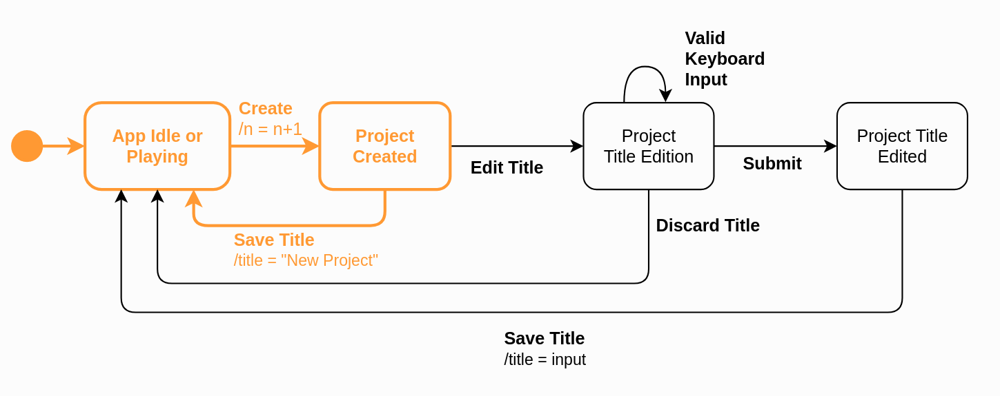

# Assignment 4 - Model-based Software Testing

## 1. Create project

JTimeSched's main goal is to allow users to track the time of certain projects. For that, the user must first create a "new project" and set its name, which allows him to distinguish between different tasks that he may want to track. For this reason, we decided to use `QF-Test` to perform Model-based testing on one of the simplest requirements of this tool, which is exactly to **create a new project**. 

### 1.1 State diagram

The diagram shown below represents the creation of projects. Given that the creation of a project triggers the edition of its title, we also represent this part of the creation flow in the diagram. However, we will not cover the case where the user updates a title by double clicking the title field, as it is not part of the "project creation" requirement.

**Initial State**: In order to create a new project, no popup window can be opened in the application i.e. the user may not click the "Add Project" button while he is editing the quotas or changing the category of a project. If that is the case, we consider that the App is "Idle". We consider that the App is "Playing" if no popup is opened but there is a project "playing". As we can only create a new project if the App is on any of these two states, our initial state is `App Idle or Playing`.
**Transitions from `App Idle or Playing`**: From the initial state, if the user presses the "Add Project" button, a new project with the default title of "New Project" will be created, thence the number of projects (`n`) is incremented by one (`n = n + 1`), as we can see in the action of the `Create` transition. This leads to a state where the new project will be in the idle state, that is, its counter is paused. 
**Transitions from `Project Created`**: After created i.e. when in the `Project Created` state; the user may edit the default title of the project - `Edit Title`; or he may decide to keep the default title, by pressing "Enter", for example, which will lead back to the initial state.
**Transitions from `Project Title Edition`**: While the user is modifying the title of the project, the state is kept in the `Project Title Edition`. From there, the user may decide to discard his changes by pressing the "Esc" key, or he may `Submit` his changes by clicking the "Enter" key, for example.
**Transitions from `Project Title Edited`**: After the user submits his input, the title of the new project is saved - `Save Title`; leading back to the initial state.

### 1.2 Transition tree 

- We start with the initial state, named `App Idle or Playing`;
- From the initial state, we only have an outgoing transition to `Project Created`, which results from the creation of a new project;
- From the `Created` state we have two outgoing edges, one to `Project Title Edition` and another to `App Idle or Playing`. The only state where we haven't been before is the `Project Title Edition`. From this state the user may go to the `Project Title Edition`, `App Idle or Playing` or `Project Title Edited`. Finally, from the `Project Title Edited` we can only go to the `App IDle or Playing` state.
From this tree, we can derive the test paths, which will be explored in the QF-Test tool and further explained in section 1.5: 
- `App Idle or Playing` -> `Project Created` -> `App Idle or Playing`
- `App Idle or Playing` -> `Project Created` -> `Project Title Edition`
- `App Idle or Playing` -> `Project Created` -> `Project Title Edition` -> `Project Title Edition`
- `App Idle or Playing` -> `Project Created` -> `Project Title Edition` -> `Project Title Edited` -> `App Idle or Playing`

### 1.3 Transition table  

| States / Events | Create | Edit Title | Submit | Valid Keyboard Input | Save Title | Discard Title |   
| - | - | - | - | - | - | - |
| App Idle or Playing |  Project Created ||||||
| Project Created || Project Title Edition ||| App Idle or Playing ||
| Project Title Edition ||| Project Title Edited | Project Title Edition || App Idle or Playing |
| Project Title Edited | | | | | App Idle or Playing || 

### 1.4 Sneak Paths 

In section **1.3**, the 17 empty cells correspond to **sneaky transitions**.
Let's map the expected behavior of each **sneaky transition**. 

- From the initial state (`App Idle or Playing`) it is clear that the `Edit Title`, `Save Title`, `Discard Title`, `Submit` and `Valid Keyboard Input` events are not  expected to generate any change of state. For instance, if we type without selecting a specific input, nothing is expected to change in the App, but there is no need to throw an exception either. Also, if the user doesn't create a project or explicitly selects a title to change, he will not be able to edit/save/discard anything, because there will be no title field selected.
- From the `Project Created` state the user is not able to `Submit` or `Discard` his input because this actions may only be triggered in a state where an input is being edited, which is not the case, as this state only represents that the project was successfully created. For the same reason, any keyboard input that doesn't trigger the acceptance of the default project title - `Valid Keyboard Input`; should be ignored in this state. Furthermore, a new `Create` event should never happen before the title of the current project is set with the default. If it is, maybe an exception should be thrown. 

### 1.5 Tests developed in QF-Test tool

For the creation requirement we used the `Creation` test-set that can be found in the QF-Test test-suite,  available in the qf-test directory.

**Requirements**: This test set assumes you have no previous configuration saved (no projects stored in memory). Please delete the `conf` folder before testing.

**Outcome**: All of the test-cases that are described below were successful. However, while building the test-set, we also tested a setup with which the tests failed due to a bug in the App. In particular, if we have 5 projects already created and we create a new one, the title of that project will not be focused just like it happens when we create the previous and next projects. We believe this happens because this is the first project that goes beyond the vertical space of the App (requires scroll).

#### 1.5.1. Create project and discard title changes

For the first test, we combined the paths shown below, to test the case where, after the user creates a project and edits its title, he discards the changes by pressing the "Esc" key, for example. The final title of the new project should be "New Project", which is the default.

The test case `01_create-and-discard-title` was the one used to test this scenario:
- It starts at the main window of the JTimeSched tool, after the App is launched, where, by default, there is no popup opened and the App is "Idle" - `App Idle or Playing` state. Considering that the requirements that we described above were respected, there are no projects in the App yet;
- Click "Add Project" (which represents the `Create` transition from `App Idle or Playing` to `Project Created`);
- Check if the project was created by verifying that there is only one project;
- Type "Project1" as the name of the project - `Project Title Edition`;
- Press "Esc" - `Discard title`;
- Check that the title was discarded by verifying that it was set to the default value - "New Project";
- Finally, a cleanup sequence was used to delete the newly created project.

#### 1.5.2 Create project and accept default title

Here we test the case where the user creates a new project and accepts the default title by pressing "Enter", for example.

The test case `02_create-and-enter` was the one used to test this scenario:
- It starts at the main window of the JTimeSched tool, after the App is launched, where, by default, there is no popup opened and the App is "Idle" - `App Idle or Playing` state. Considering that the requirements that we described above were respected, there are no projects in the App yet;
- Click "Add Project" (which represents the `Create` transition from `App Idle or Playing` to `Project Created`);
- Check if the project was created by verifying if the number of projects is one;
- Press "Enter" (`Save title` transition from `Project Created` to `App Idle or Playing`);
- Check that the name of the recently added project is the default - "New Project";
- Finally, a cleanup sequence was used to delete the newly created project.

#### 1.5.3 Create project and save custom title

For this test, we decided to combine the paths shown below, in order to test the full flow of creating a project, setting a custom title and saving it. We need to make sure that the title of the new project is the one typed by the user.

The test case `03_create_type_and_save` was the one used to test this scenario:
- It starts at the main window of the JTimeSched tool, after the App is launched, where, by default, there is no popup opened and the App is "Idle" - `App Idle or Playing` state. Considering that the requirements that we described above were respected, there are no projects in the App yet;
- Click "Add Project" (which represents the `Create` transition from `App Idle or Playing` to `Project Created`);
- Check if the project was created by verifying that there is only one project;
- Type "Project1" as the name of the project - `Project Title Edition`;
- Check if the input was changed to "Project1";
- Press "Enter" (`Save title` transition from `Project Title Edited` to `App Idle or Playing`);
- Check if the project title was changed to "Project1";
- Finally, a cleanup sequence was used to delete the newly created project.

#### 1.5.4. Sneak Path - ??

TODO

## 2. Edit time 

JTimeSched's users are able to edit a project in multiple ways: they can change its title, color, creation date, time overall, time today, quota today, quota overall or update its notes. Considering there are many different requirements associated with the edition of a project, we decided to focus on the edition of time fields, which have some interesting peculiarities to consider, in particular, the fact that they don't allow changes to be made while the project is running. As the edit actions for the `Time Overall` and `Time Today` of a project are very similar, we decided to focus only on the edit functionalities related to the `Time Today` field, mainly the edition of the time spent on a project in the current day.

###  2.1 State diagram 

> **Note 1**: The `Time Today` of a project can only be edited if that project is not "counting"/"playing". For that reason, we decided to include the play/pause use cases in this state diagram, which will then allow us to show that the transition between the `Project Playing` and the `Edit Today` state is "sneaky".
> **Note 2**: The states of this diagram refer to states of a single project.

**Initial State**: To be able to edit the `Time Today` of a project, no popup window can be opened in the application and the project must not be "playing" - its timer must not be counting. We named this state `Project Idle`. From here, the user can edit the `Time Today` field by performing a double left click on the respective input field. This transition is clear in the diagram and leads to the `Time Today Edition` state. From the idle state, the user may also press the "Play" button and start the timer of the project.
**Transitions from `Time Today Edition`**: `Time Today Edition` represents the state where the `Time Today` field of the project is focused and the user is able to update it by typing the new value, a behavior represented by the `Valid Keyboard input` self transition. To save the new value, the user can press the "Enter" key, for example. If the user submits an empty value, the time will be set to 0 and if the user submits a valid time, the field will be updated accordingly. This cases represent the conditions of the `Save Time Today` transition. However, if the user submits an invalid time or presses the "Esc" key, his changes will be discarded - `Discard Time Today`. When the input is saved or discarded, the project returns to the idle state.
**Transitions from `Project Playing`**: As we explained above, this diagram also includes the play/pause use case, to show that it is no possible to update the `Time Today` if the project is playing. In the scope of the edition of the `Time Today` field, which is the one we are portraying here, the only possible outgoing transition results from pressing the "Pause" button, which will lead back to the `Project Idle` state.

### 2.2 Transition tree

- We start with the initial state, `Project Idle`;
- From the initial state we only have two possible outgoing transitions, one to `Project Playing`, triggered by pressing the "Play" button of the respective project, and another to the `Time Today Edition` state, which is triggered by a double left click on the `Time Today ` field of the project.
- From the `Project Playing` state the only possible transition results from pressing the "Pause" button and leads back to the initial state, which was already explored. 
- From the `Time Today Edition` state, we can go back to the `Project Idle` state when we have finished editing, we can keep in the `Time Today Edition` state, while we are inserting valid input in the field, or we can press the "Play" button and simultaneously save the current input, if valid, and 
As we have already expanded every possible state, the transition tree is complete.
From this tree, we can derive the test paths, which will be explored in the QF-Test tool and further explained in section 2.5: 
- `Project Idle` -> `Project Playing` -> `Project Idle`
- `Project Idle` -> `Time Today Edition` -> `Project Idle`
- `Project Idle` -> `Time Today Edition` -> `Time Today Edition`
- `Project Idle` -> `Time Today Edition` -> `Project Playing`

### 2.3 Transition table 
| States / Events   | Time Today Double Left Click | Save Time Today | Play | Pause |
|---|---|---|---|---|---|---|
| Project Idle      | Time Today Edition | | Project Project Playing | |
| Project Playing   |  |  | | Idle |
| Time Today Edition|   |  | | |

### 2.4 Sneak Paths 

In total there are 12 sneak paths. But only two were selected to be tested:   

1. (Project Playing, Play)  
2. (Time Today Edition, Play)   

In the first sneak path, it's necessary to assess that if the project is playing: 
- The available button references the stop action.   
- By pressing the stop/play button, the project that is already running must stop.  

In the second action it's necessary to verify that if the project is running, then the "TimeToday" field can't be edited.  

### 2.5 Tests developed in QF-Test tool 

#### 1. Save Time Today

In these tests we exercise the scenario in which the user updates the `Time Today` to a valid time i.e. a time that respects the regular expression "\d+:[0-5]?\d:[0-5]?\d"; or submits an empty input. To test this, we decided to combine the paths shown below and to create two different tests: one where the input is a valid time string and another where the input is empty. In the end, we must check if the `Time Today` of the project was effectively changed.

##### 1.1. Valid Time Today
The test case `?` was the one used to test this scenario.
First, we recorded a sequence that represents all the states and transitions:
- The sequence starts at the main window of the JTimeSched tool, with a project already available....

##### 1.2. Empty Time Today

#### 2. Discard Time Today

Here we test the cases where the user submits an invalid `Time Today` i.e. a time that doesn't respects the regular expression "\d+:[0-5]?\d:[0-5]?\d"; or presses "Esc" to discard his changes. In the end, we expect that the `Time Today` value remains the same.

##### 2.1. Invalid Time Today

##### 2.2. Discard Time Today

#### 3. Play/Pause 

As we explained above, the play/pause use case was also included here. Here, we want to check that it is possible to play and pause a project if no popup windows are opened.

#### 4. (Sneak Path 1) Edit time today while playing 

## 3. Delete Project

As mentioned before, JTimeSched's main goal is to allow users to track the time of their projects. As well as creating a project, to manage the software the user also must be able to delete the projects.   
The malfunctioning of the delete use case not only would cause chaos in the administration of information but probably would compromise the program usage in a long term. For this reason, it's crucial.  

###  3.1 State diagram   

This diagram shows the flow to delete a project in the system perspective.  

- **App Idle or Playing**: In this initial state the software can be idle or not. 
- **Project Selected**: A project selected is one that is highlighted in blue. This action can be performed by a click. 

One might ask why the **play** and **pause** events were represented in this diagram, since they might represent a different use case. The reason behind this analysis, comes from the fact that some actions are forbidden while a project has its counter in execution. Therefore, it's important to check that the `delete` case is not included in the forbidden actions in the **Project Playing** state, given that errors in conditions of this kind are not uncommon. 

### 3.2 Transition tree

- We start with the **Project Idle** state (**Project_Idle_0**); 
- From `Project Idle` we have two transitions: one to it self (**Project_Idle_1**) when deleting a project and another to set a project as playing (**Project_Playing_0**); 
- From the **Project_Idle_1**, we have the same possibilities of transitions as in **Project_Idle_0**. Since these were already exercised, we set **Project_Idle_1** as a leaf;  
- **Project_Playing** (**Project_Playing_0**) we can pause the project, which leads to the **Project_Idle** (**Project_Idle_2**) state, or we can delete a project, which leads us to the same **Project_Idle** (**Project_Idle_3**) state. 
- Since all the outgoing transitions from **Project_Idle** were exercised, we let **Project_Idle_2** and **Project_Idle_3** as the leaves of the tree.  

### 3.3 Transition table 

| States / Events | Delete | Play | Pause | 
|- | - | - | -  |
| Project Idle | Project Idle | Project Playing | |  
| Project Playing | Project Idle | | Project Idle | 

### 3.4 Sneak Paths 

Here there're two sneak paths. 
| (State, Event) | Behavior | Explanation | 
| - | - | - | 
| (Project Idle, Pause) | Nothing | If a project is paused and it was paused again, then it should remain in the same state |
| (Project Playing, Play) | Nothing | Analog to the previous situation. If a counter is already counting, then the final state should be the same, but the counter should not be reseted |  
### 3.5 Tests developed in QF-Test tool 

#### 3.5.1 Start and pause a project
<!-- TODO: justify this -->
After starting and pausing a project, the user must be able to delete it. In the test 3.5.3 we verify that if the project is idle, then it must be possible to delete it. 
This test, thus, verifies that if the project was started it also must be able to stop and return to the correct state. If the state is correct, the test **3.5.3** assess whether it will be able to stop it.  

#### 3.5.2 Play and delete a project
Here we initialize the counter of a project and delete this same project. This should lead us with another idle project selected.  

#### 3.5.3 Delete a project  
In this scenario we simply try to delete a project that is not in execution. Still in this case there are two subscenarios: delete one single project and the other is to delete two or more projects in sequence.   

## 3.5.4 Sneak Path 

## QF-Test tool feedback 

The tool is really intuitive, however: 
- It was hard to understand if a specific test has passed. There is a small on the bottom right corner. It would be better to also have a message similar to the JUnit tool, that represents if a test has passed or failed in a clear way. This might not make difference to old users, but it improve the experience of new users.   
- The design is another point. It wouldn't make difference to old customers that are already clients of the tool, but improving the design would make more attractive.  
- Selecting a table cell ..................
- Doesn't show where the error was?
- input selecionado ou nao