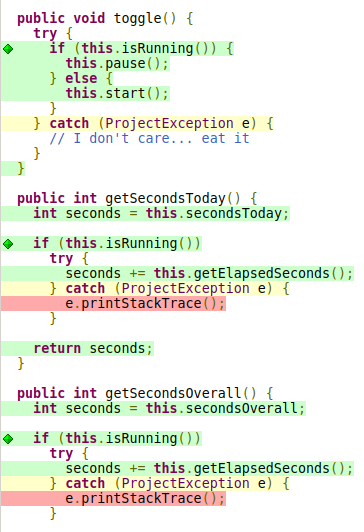

# Assignment 4 - Coverage Test

## Line and Branch Coverage

Considering that the _line coverage_ and _branch coverage_ are defined by the following formulas:
$$ line\space coverage = \frac{lines\space covered}{lines} \times 100 \%$$
$$ branch\space coverage = \frac{decision\space outcomes\space coverage} {decision\space outcomes} \times 100\%$$
And having into account the report generated by the _Jacoco_ plugin:

The percentage of test coverage represented by the tests in _assignments #3 and #2_ is **only 4%** in both _line and branch coverage_.

However, when not considering the _gui_ classes, this coverage increases to:

$$ line\space coverage = [1- \frac{273+48+6}{316+48+6}] \times 100\% = 11.62\%$$

<!-- TODO: o branch coverage está certo?-->

$$ branch\space coverage = [1-\frac{87+12+2}{106+12+2}] \times 100\% = 15.83\%$$

Yet, each test case covered its target function at 100% in both _line coverage_ and _branch coverage_.

### Test 1 - project.ProjectSerializer.addXmlElement

### Test 2 - project.Project.setSecondsToday

### Test 3 - project.ProjectTime.parseSeconds

### Test 4 - project.ProjectTime.formatSeconds

### Test 5 - project.ProjectTableModel.isCellEditable

<!-- ========================================================================== -->

## New tests

<!-- Dúvida: criar testes indiscriminadamente?? -->

### Project class

We were able to achieve 100% branch coverage and 97% line coverage for the `Project Class`.

The only lines that were not tested are presented below.

#### Test 6 - setSecondsOverall

The function `setSecondsOverall` includes a single if condition. For this reason, two different input values were tested, one that makes the condition evaluate to false (`secondsOverall` >= 0) and another that makes it evaluate to true (`secondsOverall` < 0).
To create this test we used the ParameterizedTest `setSecondsTodayTest`, which uses the MethodSource `genSecondsOverall` to feed the function with the input values.

**Inputs used**: -2 and 10

**Outcome**: The test passed successfully.

#### Tests [7 - 14] - setQuotaToday

To test most of the setters of the `Project` class, mainly the methods:

- `setQuotaToday`;
- `setQuotaOverall`;
- `setTitle`;
- `setNotes`;
- `setColor`;
- `setChecked`;
- `setTimeStart`;
- `setTimeCreated`;
  we used simple junit Tests that assert if the properties were effectively changed to the expected value. As this methods don't have any conditions and consist of a single line of code, the test is also very simple.
  Additionally, for the `setColor`, `setTimeStart` and `setTimeCreated` we use Mockito to mock the `Color` and `Date` classes.

**Inputs used**:
- `setQuotaToday` - 5;
- `setQuotaOverall` - 5;
- `setTitle` - "New Project";
- `setNotes` - "This is a note";
- `setColor` - Color mock;
- `setChecked` - true;
- `setTimeStart` - Date mock;
- `setTimeCreated` - Date mock.

**Outcome**: The tests passed successfully.

### Line and Branch Coverage

<!--Line and branch coverage of the unit tests you have developed in this assignment.-->
