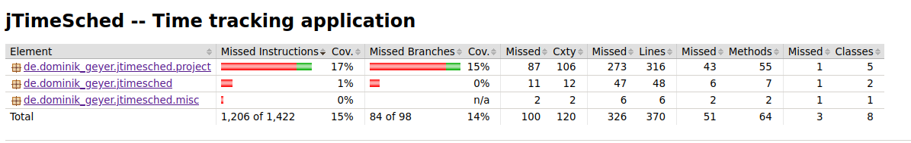
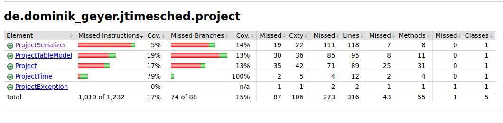
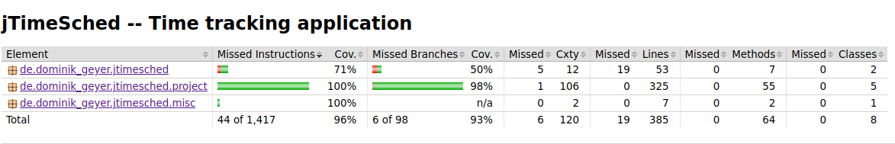
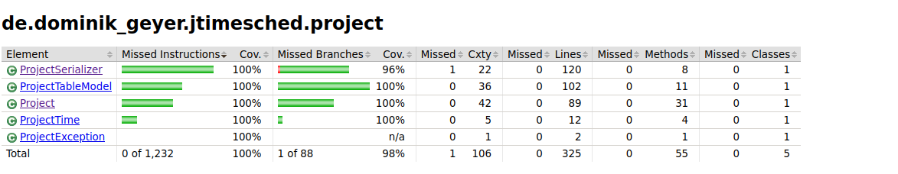
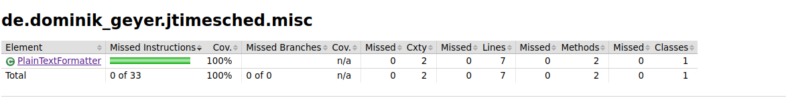
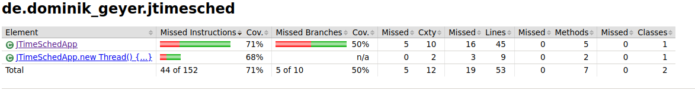

# Assignment 4 - Coverage Test

## Line and Branch Coverage

Considering that the _line coverage_ and _branch coverage_ are defined by the following formulas:
$$ line\space coverage = \frac{lines\space covered}{lines} \times 100 \%$$
$$ branch\space coverage = \frac{decision\space outcomes\space coverage} {decision\space outcomes} \times 100\%$$
And having into account the report generated by the _Jacoco_ plugin:





The percentage of test coverage represented by the tests in _assignments #3 and #2_ is **only 15%** in _line coverage_ and **14%** in _branch coverage_ , when not considering the _gui_ classes.


Yet, each test case from these assignments covered its target function at 100% in both _line coverage_ and _branch coverage_.


### Test 1 - project.ProjectSerializer.addXmlElement


### Test 2 - project.Project.setSecondsToday


### Test 3 - project.ProjectTime.parseSeconds


### Test 4 - project.ProjectTime.formatSeconds


### Test 5 - project.ProjectTableModel.isCellEditable


<!-- ========================================================================== -->

## New tests

### Project class

We were able to achieve 100% branch coverage and 100% line coverage for the `Project Class`.


#### Test 6 - setSecondsOverall

The function `setSecondsOverall` includes a single if condition. For this reason, two different input values were tested, one that makes the condition evaluate to false (`secondsOverall` >= 0) and another that makes it evaluate to true (`secondsOverall` < 0).
To create this test we used the **ParameterizedTest** `setSecondsTodayTest`, which uses the **MethodSource** `genSecondsOverall` to feed the function with the input values. We then assert that the value of `secondsOverall` was effectively changed, with an `Assertions.assertEquals`: 

```java 
Assertions.assertEquals(expected, project.getSecondsOverall());
``` 

**Inputs used**: -2 and 10

**Outcome**: The test passed successfully.

#### Tests [7 - 14] - setters

To test most of the setters of the `Project` class, mainly the methods:

- `setQuotaToday`;
- `setQuotaOverall`;
- `setTitle`;
- `setNotes`;
- `setColor`;
- `setChecked`;
- `setTimeStart`;
- `setTimeCreated`;  

We used simple junit Tests that assert if the properties were effectively changed to the expected value. As these methods don't have any conditions and consist of a single line of code, the tests are also very simple.   
Additionally, for the `setColor`, `setTimeStart` and `setTimeCreated` we use Mockito to mock the `Color` and `Date` classes.  

An example of an assert is the following, which is used at the `setQuotaTodayTest`:  
```java
Assertions.assertEquals(5, project.getQuotaToday());
```

**Inputs used**: 
- `setQuotaToday` - 5;
- `setQuotaOverall` - 5;
- `setTitle` - "New Project";
- `setNotes` - "This is a note";
- `setColor` - Color mock;
- `setChecked` - true;
- `setTimeStart` - Date mock;
- `setTimeCreated` - Date mock.

**Outcome**: The tests passed successfully.


#### Test 15 - resetToday
This test only verifies if the `resetToday` method successfully resets the values of the `secondsToday` and `quotaToday` to 0 and that the date was reset.  

For that purpose, we first set the `secondsToday` and `quotaToday` to 2 seconds and the `timeStart` to yesterday. After that, we call the `resetToday` method and assert that the values were reset: 

```java 
Assertions.assertEquals(0, project.getSecondsToday());
Assertions.assertEquals(0, project.getQuotaToday());
Assertions.assertTrue(project.getTimeStart().compareTo(now) >= 0);
```   

**Inputs**:
- An idle project with `secondsToday` = 2, `quotaToday` = 2 and `timeStarted` = yesterday;   

**Outcome**: The test passed successfully.

#### Tests [16 - 17] - toString
This method represents the project as a String. It has 2 conditions:  

- the first is used to print "yes" or "no" depending on the value of the `running` flag;
- the second is used to print "yes" or "no" depending on the value of the `checked` flag.
With this in mind, we created the tests:
- `newProjectToStringTest`: tests if the output of the `toString` method is the expected when called on a new project, which by default is not running and not checked;
- `runningAndCheckedProjectToStringTest`: which tests if the output of the `toString` method is the expected when called on a project that is running and checked.

The following assertions were made: 

```java 
// newProjectToStringTest() 
String result = project.toString();
String expected =
      "Project [title=New Project, running=no, secondsOverall=0, secondsToday=0, checked=no]";
Assertions.assertEquals(expected, result); 

// runningAndCheckedProjectToStringTest()  
String result = project.toString();
String expected =
        "Project [title=New Project, running=yes, secondsOverall=0, secondsToday=0, checked=yes]";
Assertions.assertEquals(expected, result);
```
 
**Inputs**:
- `running` = false and `checked` = true
- `running` = true and `checked` = true.

**Outcome**: The tests passed successfully.

#### Test 18 - adjustSecondsToday
The function `adjustSecondsToday` includes a single if condition. For this reason, two different input values were tested, one that makes the condition evaluate to false (`secondsToday` >= 0) and another that makes it evaluate to true (`secondsToday` < 0).
To create this test we used the `ParameterizedTest` `adjustSecondsTodayTest`, which uses the `MethodSource` `genAdjustSecondsToday` to feed the test with:  
- `secondsToday`: parameter passed to `adjustSecondsToday`;
- `olSecondsToday`: original value of `secondsToday`, before calling `adjustSecondsToday`;
- `oldSecondsOverall`: original value of `secondsOverall` before calling `adjustSecondsToday`;
- `expectedSecondsToday`: the expected value of `secondsToday` after calling `adjustSecondsToday`;
- `expectedSecondsOverall`: the expected value of `secondsOverall` after calling `adjustSecondsToday`;  

The parameters `oldSecondsToday` and `oldSecondsOverall` are used to set the initial values of the respective variables of the project. After that, the function `adjustSecondsToday` is called.
We then assert that the values of `secondsOverall` and `secondsToday` are changed according to the input by using the `Assertions.assertEquals` method: 

```java  
Assertions.assertEquals(expectedSecondsToday, project.getSecondsToday());
Assertions.assertEquals(expectedSecondsOverall, project.getSecondsOverall());
```

**Inputs**:  
- Case 1 - `secondsToday` < 0:
  - `secondsToday`: -2;
  - `olSecondsToday`: 10;
  - `oldSecondsOverall`: 43;
  - `expectedSecondsToday`: 0;
- `expectedSecondsOverall`: 33 (old value minus the old secondsToday, which is now 0);
- Case 2 - `secondsToday` >= 0: 
  - `secondsToday`: 16;
  - `olSecondsToday`: 10;
  - `oldSecondsOverall`: 43;
  - `expectedSecondsToday`: 16;
- `expectedSecondsOverall`: 49 (adds 6 to the old value,  the seconds that have passed);

**Outcome**: The tests passed successfully.

#### Tests [19 - 20] - getElapsedSeconds
This method has only one condition that checks if the project is running. For this reason, we developed two different tests - `idleElapsedSecondsTest` and `runningElapsedSecondsTest`; where the first tests this function when the project is idle and the second when it is running. If the project is not running we use `assertThrows` to verify if the exception is thrown. Otherwise, we verify if we can successfully retrieve the elapsed seconds:

```java 
// idleElapsedSecondsTest  
Assertions.assertThrows(ProjectException.class, () -> project.getElapsedSeconds()); 

// runnignElapsedSecondsTest 
// When and Then
try {
  Assertions.assertEquals(0, project.getElapsedSeconds());
} catch (ProjectException e) {
  fail("Exception shouldn't be thrown");
}
```

**Inputs**:
- `running` = false (the default value when a new project is created);
- `running` = true (we use `setTunning(true)` to set this value).

**Outcome**: The tests passed successfully.

#### Test [21 - 22] - start
The outcome of the `start` method depends on the state of the project - when the project is running it must throw an exception, otherwise the `running` flag must be set to true and the `timeStart` should be higher or equal to the actual time.
For the first case we use `runningStartTest` where we assert that an exception is thrown by using the `assertThrows`method.
For the second test we use `idleStartTest`, where we assert that the `running` flag is set to true and that the start time of the project is equal or higher to the actual time. For that we use the `assertTrue` method. 

The assertions can be checked below: 
```java 
// idleStartTest 
Assertions.assertTrue(project.isRunning());
Assertions.assertTrue(project.getTimeStart().compareTo(now) >= 0); 

// runningStartTest 
Assertions.assertThrows(ProjectException.class, () -> project.start()); 
```

**Inputs**:
- running = false (the default value when a new project is created);
- running = true;

**Outcome**: The tests passed successfully.

#### Test [23 - 24] - pause
Similarly to the last method, the outcome of the `pause` method depends on the state of the project - when the project is running we must be able to call this method, which should pause the project and update its time and `running` flag, otherwise an exception should be thrown.
For the first case we use `runningPauseTest` where we:
- set the project `running`flag to true;
- create a spy using Mockito;
- use Mockito to make `getElapsedSeconds` return 2;
- call the `pause` method;
- verify if `secondsOverall` and `secondsToday` were updated to 2 and that the `running` variable is false.  

For the second test we use `idlePauseTest`, where we assert that an exception is thrown with `assertThrows`. The assertions can be checked below:  

```java  
// idlePauseTest 
Assertions.assertThrows(ProjectException.class, () -> project.pause()); 

//runningPauseTest  
Assertions.assertEquals(2, spy.getSecondsOverall());
Assertions.assertEquals(2, spy.getSecondsToday());
Assertions.assertEquals(false, spy.isRunning());
```  

**Inputs**:
- `running` = false (the default value when a new project is created);
- `running` = true;
> In this last case (`running` = true) we also assume that the elapsed time is 2 seconds;

**Outcome**: The tests passed successfully.

#### Test [25 - 27] - toggle
The toggle method also depends on the state of the project - if it is running then it must call the `pause` method, otherwise it must call the `start` method. Additionally, if any of these methods throws and exception, the exception should be caught. To test all these cases we created 3 tests;
- `runningToggleTest`: tests if the `running` flag is set to false when the `toggle` method is called while the project is running;
- `idleToggleTest`: tests if the `running` flag is set to true when the `toggle` method is called while the project is idle;
- `exceptionToggleTest`: tests if the `toggle` method is able to catch an exception thrown by the  `start` call. For this, we use Mockito to create a spy and use the method `doThrow` to simulate an exception on the `start` method.

The assertions can be checked below: 
```java 
//runningToggleTest 
Assertions.assertEquals(false, project.isRunning()); 
//idleToggleTest 
Assertions.assertEquals(true, project.isRunning()); 
//exceptionToggleTest 
Assertions.assertDoesNotThrow(() -> spy.toggle());
``` 


**Inputs**:
- `runningToggleTest`: `running` = true; 
- `idleToggleTest`: `running` = false;
- `exceptionToggleTest`: `running` = false;
> In this last case we also use Mockito to ensure  that the `start` method throws an exception.

**Outcome**: The tests passed successfully.

#### Test [28 - 30] - getSecondsOverall
This method has a condition and `try catch` statement. For this reason, we decided to develop 3 tests to get full coverage:
- `runningGetSecondsOverallTest`: Verifies the behavior of the method when the project is running(condition evaluates to true);  
- `idleGetSecondsOverallTest`: Verifies the behavior of the method when the project is idle (condition evaluates to false);  
- `exceptionGetSecondsOverallTest`: Tests the behavior when the condition evaluate to true and an exception occurs in the `pause` method.  

When using this method while the project is running, we must assure that the value reflects the elapsed time. For this reason, in the `runningGetSecondsOverallTest` we used a spy to ensure that the `getElapsedSeconds` method returned 10 seconds and then verified if the `timeOverall` was correctly updated to 10 seconds.
If this method is called while the project is idle or if an exception occurs we need to make sure that the `timeOverall` will not change. For this reason, in the `idleGetSecondsTodayTest` we set the initial `timeOverall` to 10 and then verified if after calling the `getElapsedSeconds` method the value was the same. In the `exceptionGetSecondsOverallTest` we also set the initial value of the `timeOverall` to 10 and used a spy to ensure that the `getElapsedSeconds` method throws an exception. We then tested if the `timeOverall` was the same as the initial.

The assertions can be checked below: 
```java 
//runningGetSecondsOverallTest 
Assertions.assertEquals(10, result); 
//exceptionGetSecondsOverallTest 
Assertions.assertEquals(10, result);
``` 

**Inputs**:
- `runningGetSecondsOverallTest`: 
  - running = true;
  > In this case we also assume that the elapsed time is 10 seconds;
- `idleGetSecondsOverallTest`: 
  - initial `secondsOverall` = 10;
  - `running` = false;
- `exceptionGetSecondsOverallTest`:
  - initial `secondsOverall` = 10;
  - `running` = false;
**Outcome**: The tests passed successfully.

#### Test [31 - 33] - getSecondsToday
In this test we followed exactly the same approach as in the previous tests for the `getSecondsOverall`, so we are not going to extend ourselves. The tests developed were the following: `runningGetSecondsTodayTest`, `idleGetSecondsTodayTest` and `exceptionGetSecondsTodayTest`. The assertions can be checked below: 

```java 
//runningGetSecondsToday & idleGetSecondsToday 
Assertions.assertEquals(10, result); 
```

**Inputs**:  
-`runningGetSecondsTodayTest`: 
  - running = true;
  > In this case we also assume that the elapsed time is 10 seconds;
- `idleGetSecondsTodayTest`: 
  - initial `secondsToday` = 10;
  - `running` = false;
- `exceptionGetSecondsTodayTest`:
  - initial `secondsToday` = 10;
  - `running` = false;  

**Outcome**: The tests passed successfully.

### ProjectTableModel class 

Before we talk about the created tests, it's essential to highlight the actions performed initially as a setup. Therefore, we will explain the `initProjectTableModel` function in the following few lines. 

```java 
@BeforeEach 
public void initProjectTableModel(); 
```

This function is responsible for initializing the `Logger` using **java reflection** and setup an instance of the `ProjectTableModel` class with one `Project` inside it. 

In addition to that, after the execution of each test, the instance of the `project` is set to null:

```java
  @AfterEach
  public void setNullProjectTableModel() {
    projectTableModel = null;
  }
```

#### Test 34 - testGetColumnCount 

Tests if the number of columns matches the supposed one: 8. 
For this test it used an `Assertions.assertEquals`: 

```java
    Assertions.assertEquals(columnCount, 8);
```

**Inputs**: No input was provided to the this test. 

**Outcome**: The test passed successfully.

#### Test 35 - testGetRowCount 

It checks the number of projects in the `ProjectTableModel`. 
In the end, performs an `Assertions.assertEquals` over the number of projects, which is expected to be 1. 

``` java 
Assertions.assertEquals(rowCount, 1);
``` 

**Input**: A project was added upon the creation of the class. 

**Outcome**: The test passed successfully.

#### Test 36 - testColumnName 

Tests if the name of the column is read well. 
Performs an `Assertions.assertEquals` over the name returned: the second column, which should be `Title`:  

```java 
Assertions.assertEquals(columnName, "Title");
```

**Inputs**: 
  - `column`: 2  
  
**Outcome**: The test passed successfully.

#### Test 37 - testAddProject 

This function verifies if the addition of a project in the `ProjectTableModel` is performed with success.   
The test adds a project and then verifies whether the number of projects in the `ProjectTableModel` instance is 2. 
It also verifies whether the project is located in the correct position in the rows, which is expected to be in the end. 
To achieve this, two `Assertions.assertEquals` were used: 
 
```java
Assertions.assertEquals("Project1", projectName);
Assertions.assertEquals(2, projectCount);
```

**Inputs**: 
  - A `new Projet("Project1")` is used as input. 
  
**Outcome**: The tests passed successfully.

#### Test 38 - testRemoveProject 

This test verifies if the removal of a project in the `ProjectTableModel` is performed successfully. 

After removing a project, it's checked if the number of projects in the `ProjectTableModel` instance is the expected using `Assertions.assertEquals`:

```java
Assertions.assertEquals(0, projectCount);
```

**Inputs**: A project is added to the `ProjectTableModel` class upon its creation.  

**Outcome**: The tests passed successfully.

#### Test 39 - testColumnClass 

This test verifies if the class type of a column is correct.  
Inside the `getColumnClass` function there is a **switch case**, which receives the **number of the column** and **return the expected class**. 

This is a `@ParameterizedTest` test, which receives the **column value** and the **expected class** to be returned, from a function called `genGetValueAt`: 

```java
@ParameterizedTest
@MethodSource("genGetColumnsClass")
public void testGetColumnClass(int value, Class expected);
```

In the end an `Assertions.assertEquals` is made to check the column class returned and the expected value.  

```java 
Assertions.assertEquals(expected, columnClass); 
``` 

**Inputs**: 
  - `value`:
    - `ProjectTableModel.COLUMN_COLOR`;
    - `ProjectTableModel.COLUMN_CREATED`;
    - `ProjectTableModel.COLUMN_TIMEOVERALL`;
    - `ProjectTableModel.COLUMN_TIMETODAY`;
    - `ProjectTableModel.COLUMN_CHECK`;
    - `ProjectTableModel.COLUMN_ACTION_DELETE`;
    - `ProjectTableModel.COLUMN_ACTION_START_PAUSE`;
    - 8; this is an out of bounds value. Thus tests the default condition of the switch case.   
- 
**Outcome**: The tests passed successfully.

#### Test 40 - testGetValueAt
This test assesses a value of a project in a specific position in the `ProjectTableModel` instance.  

This test works with two projects, in order to cover the branches. 
One project contains values that would set conditions to true inside the `getValueAt` function, and the other project would carry values that would set the if conditions to `false`.  

This test carries the `@ParameterizedTest`  annotation and received the following parameters from the `genGetGetValueAt` method source: `column`, `expected` and `row`.  

The `row` indicates what project we are testing, the column is the identification column number and the `expect` parameter is the expected value of the test: 

```java
@ParameterizedTest
@MethodSource("genGetValueAt")
public void testGetValueAt(int column, Object expected, int row); 
```

It is used an `Assertions.assertEquals` in this test as it follows: 

```java 
Assertions.assertEquals(expected, obj);
```

#### 41 - testSetValueAt

This test is similar to the `testGetValueAt`, but instead of retrieving values, it sets.  

As well as in the `testGetValueAt`, this test carries the `@ParameterizedTest` annotation and a `@MethodSource`. 

It receives the following parameters from the `genSetValueAt` helper function: `column`, `value`, `row`: 

```java 
@ParameterizedTest
@MethodSource("genSetValueAt")
public void testSetValueAt(int column, Object value, int row); 
```

The `column` is the identification number of the column to set the value, the `value` is the value to be set, and the `row` is the position of the project inside the `ProjectTableModel` instance.  

This function contains a switch case and inside the `ProjectTableModel.COLUMN_TIMEOVERALL` and `ProjectTableModel.COLUMN_TIMETODAY`, it has a condition: 

```
if (column == ProjectTableModel.COLUMN_TIMEOVERALL)
```

Testing all the options in the switch case, automatically covers the cases when this condition is `true` and `false`.  

This test uses an `Assertions.assertEquals`: 

```java 
Assertions.assertEquals(value, actualValue); 
``` 

**Inputs**: 
  - Two projects are added to the `ProjectTableModel`, where one project contains default values and the other is configured as it follows: 
    - `title`: "title"; 
    - `checked`: true;
    - `color`: Color.BLUE; 
    - `timeCreated`: new Date(0); 
    - `secondsOverall`: 1; 
    - `secondsToday`: 1; 
    - `running`: true;
  - `row`: {`0`,`1`}, where the `0` is default project and `1` is the "personalized" one;
  - `column`: [`1`, `8`].
**Outcome**: The tests passed successfully.

### ProjectSerializerTest class

The tests 34 to 36 follow a similar pattern: 

- `getEndXmlElement`; 
- `addXmlElement`; 
- `startXmlElement`; 

- First a `setup()` function is called. This function sets a `static TransformerHandler hd`, whose data is stored in `static ByteArrayOutputStream bytearr`. This means that everytime that new information is added to `hd` it is written in the `bytearr`, so that the output can be analysed by parsing the result to string with `new String(bytearr.toByteArray())`. An example is: 

```java 
  Assertions.assertEquals("<?xml version=\"1.0\" encoding=\"UTF-8\"?></projects>", new String(bytearr.toByteArray()));
```

Still, for the changes in the `TransformerHandler` to trigger this effect, the operation must be envolved between `hd.startDocument()` and `hd.endDocument()`. An example is the `testGetEndXmlElement()`: 

```java
      // Given
      setup();

      // When
      hd.startDocument();
      ProjectSerializer.endXmlElement(hd, "projects");
      hd.endDocument();

      // Then
      Assertions.assertEquals("<?xml version=\"1.0\" encoding=\"UTF-8\"?></projects>",
          new String(bytearr.toByteArray()));
```

In this case, the `ProjectSerializer.endXmlElement(hd, "projects");` is envolved by `hd.startDocument()` and `hd.endDocument()`.


#### 36 - testGetEndXmlElement 

This test verifies the `endXmlElement(TransformerHandler hd, String element);` adds an end element to the xml.  

This test performs an `Assertion.assertEquals`: 

```java 
Assertions.assertEquals( "<?xml version=\"1.0\" encoding=\"UTF-8\"?></projects>", new String(bytearr.toByteArray())); 
```

**Input**: 
  - `TransformerHandler hd`;
  - `element`: `projects`. 
  - 
**Outcome**: The test passed successfully. 

#### 37 - testAddXmlElement 

The `addXmlElement` adds an xml element to the document. 

```java 
protected static void addXmlElement(TransformerHandler hd, String element, AttributesImpl atts, Object data); 
``` 

There are two conditions in this function and one doesn't influence the other. 
```java 
if (atts == null)
if (data != null)
```

To cover the branch cases, we have separated two test cases: 
- `testAddXmlElementNull`; 
- `testAddXmlElementNotNull`; 

The difference between both resides on the `atts` and `data` parameters being null or not. In other words, in the `testAddXmlElementNull` the values of these two parameters are null and in the other case test they aren't. 

We didn't test all the combinations between `atts` and `data`, since it would be redundant to test the cases below, due to the fact that, as explained before, one condition doesn't influence the other. 

- `atts` = null, `data` != null;  
- `atts` != null, `data` = null

Both tests use an `Assertions.assertEquals`: 

```java 
// testAddXmlElementNull 
Assertions.assertEquals( "<?xml version=\"1.0\" encoding=\"UTF-8\"?><title/>", new String(bytearr.toByteArray()));  
// testAddXmlElementNotNull 
Assertions.assertEquals("<?xml version=\"1.0\" encoding=\"UTF-8\"?><element>title</element>", new String(bytearr.toByteArray()));  
```

**Inputs**:
  - `testAddXmlElementNull`: 
    - `hd`: `TransformerHandler` created in the setup; 
    - `element`: "title"; 
    - `atts`: null; 
    - `data`: null; 
  - `testAddXmlElementNotNull`: 
    - `hd`: `TransformerHandler` created in the setup; 
    - `element`: "element"; 
    - `atts`: new AttributesImpl(); 
    - `data`: "title"; 
 
**Outcome**: The tests passed successfully.

#### 38 - testStartXmlElement 

The `startXmlElement` adds a starting element to xml. 

```java 
protected static void startXmlElement( TransformerHandler hd, String element, AttributesImpl atts); 
```

This function contains the following condition: 
```java 
if (atts == null)
```

To cover all the branches related to this condition, two tests were created: 
- `startXmlElementWithAtts`: the given `atts` to the function is not null; 
- `startXmlElementNoAtts`: the given `atts` to the function is null; 

This test performs the following assertions: 

```java
// startXmlElementWithAtts 
Assertions.assertEquals("<?xml version=\"1.0\" encoding=\"UTF-8\"?><element>", new String(bytearr.toByteArray()));
// startXmlElementNoAtts 
Assertions.assertEquals( "<?xml version=\"1.0\" encoding=\"UTF-8\"?><tag>", new String(bytearr.toByteArray())); 
``` 
**Inputs**: 
  - `startXmlElementWithAtts`: 
    - `hd`: `TransformerHandler` created in the setup; 
    - `element`: "element`;
    - `atts`: `new AttributesImpl()` 
  - `startXmlElementNoAtts`: 
    - `hd`: `TransformerHandler` created in the setup; 
    - `element`: "tag`;
    - `atts`: null; 

**Outcome**: The tests passed successfully.

#### 39 - testAddXmlAttribute  

This test verifies if an attribute addition to a xml element is performed correctly. 

To perform this, an `Assertions.assertEquals()` function is called, as: 

```java 
Assertions.assertEquals("my-title", atts.getValue("title"));
```

**Inputs**:
    - `atts`: `new AttributesImpl()`; 
    - `attribute`: `"title"`; 
    - `data`: `"my-title"`;  
  
**Outcome**: The test passed successfully.

#### 40 - testGetFirstElement 

This function verifies if the first child element of an xml tag is retrieved with success. 

Two assertions are made in this test: 

```java
Assertions.assertEquals("tag1", nodeName);
Assertions.assertEquals(null, nodeValue);
```

The first checks the name of the tag, the second checks the value associated, which in this case is none. 

**Inputs**:   
  - `e`: The root of the following xml: `"<tag><tag1><tag2>another tag</tag2></tag1></tag>"`. 
  - `name`: "tag1"
  
**Outcome**: The test passed successfully.


#### 41 - readXml 

This test reads a `xml` file and verifies if all information contained in it was stored. For this, we have created a file to be read, located at `docs/05_assignment/inputDir/projectTest`.  

This file contains two projects. The first one was designed to be the simplest as possible: there is no title, quotas, color, it's not checked neither running and no notes. The second project, on the other hand, was designed to be as complete as possible. This approach allows to test almost all the possible cases of conditions inside the `readXml` function.

In total there're 19 assertions in this tests. All of them are `assertEquals` verifications. 

**Inputs**: The name of the document upon initializing the `ProjectSerializer` class: `"docs/05_assignment/inputDir/projectTest"`. 

**Outcome**: The test passed successfully.


#### 42 - writeXml

To test the `writeXml` method, we decided to create 3 different tests to cover all the branches:
- `zeroProjectsWriteXmlTest`: tests if the `writeXml` outputs the expected XML when there are no projects;
- `colorRunningCheckedWriteXmlTest`: to test if the output is the expected when the project is running, checked and has a color;
- `noColorIdleUncheckedWriteXmlTest`: to test if the output is the expected when there is a project that is unchecked and that has a `null` color.

In order to compare the output of this method with the expected, we defined the filename of the `ProjectSerializer` and used the auxiliary function `readProjectsFile` to read this file. We then used the `assertTrue` method to verify that the output matched the expected regular expression.

**Inputs used**:
- `zeroProjectsWriteXmlTest`: empty list of projects;
- `colorRunningCheckedWriteXmlTest`: a list of projects with a single project; This project must have a color, `running`= true and `checked` = true;
- `noColorIdleUncheckedWriteXmlTest`: a list of projects with a single project; This project must have a null color, `running` = false and `checked` = false; 

**Outcome**: The test passed successfully.

### PlainTextFormatter class

#### Test 44 - format
To test the `format` function we simply create a `LogRecord`, used it as input and verified if the output of the `format` function is the expected by using the `assertEquals` method.

**Inputs used**: A `LogRecord` with the message "This is a log", Level.ALL; and 1668014664908 milliseconds.

**Outcome**: The test passed successfully.

### ProjectTime class

#### Test 43 - parseDate
To test the `parseDate` function we verify if it is able to convert the String "2022-11-7" to the appropriate date. For that, we use an `assertTrue` that checks if the comparison of the expected date and the actual return value of the function is the same by using the `compareTo` method of the `Date`class:
```java
Assertions.assertTrue(d.compareTo(result) == 0);
```

**Inputs used**: "2022-11-7"

**Outcome**: The test passed successfully.

#### Test 44 - formatDate
To test the `formatDate` function we verify if it is able to convert the `Date`represented by the epoch timestamp 1667779200000 to the appropriate String. For that, we use an `assertEquals` that checks if the comparison of the expected date and the actual return value of the function is the same.

**Inputs used**: Date(1667779200000l)

**Outcome**: The test passed successfully.

### JTimeScheApp class

#### Test 45 - main
Given the complexity of the `main` function, the lack of `dependency injection` i.e. most of the variables are created inside the function instead of being provided in the parameters; and the usage of private methods, we developed a single test for this method: `testConfFolder`.
In this test we verify if that the configuration folder is created when it does not exist. For that, we use both the `assertFalse` method to check that the configuration file doesn't exist before calling the `main` function (pre-condition) and then the `assertTrue` to verify if it exists after calling it.

**Outcome**: The test passed successfully.

### Line and Branch Coverage

In the end, we achieved **96%** of _line coverage_ and **93%** of _branch coverage_.









