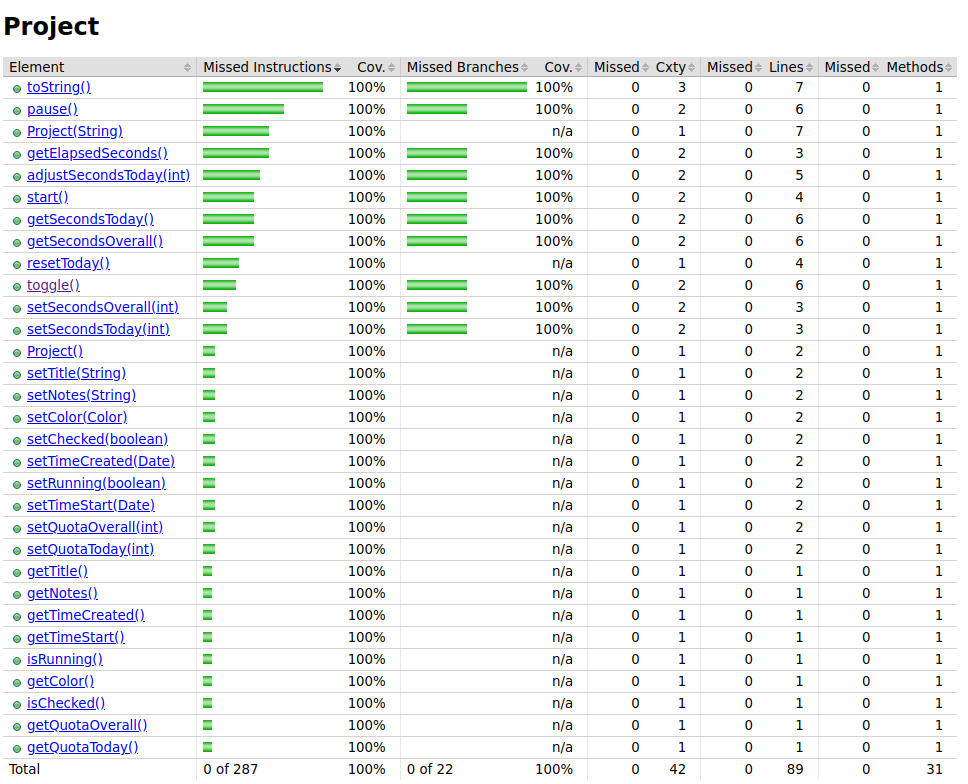

# Assignment 4 - Coverage Test

## Line and Branch Coverage

Considering that the _line coverage_ and _branch coverage_ are defined by the following formulas:
$$ line\space coverage = \frac{lines\space covered}{lines} \times 100 \%$$
$$ branch\space coverage = \frac{decision\space outcomes\space coverage} {decision\space outcomes} \times 100\%$$
And having into account the report generated by the _Jacoco_ plugin:


The percentage of test coverage represented by the tests in _assignments #3 and #2_ is **only 4%** in both _line and branch coverage_.

However, when not considering the _gui_ classes, this coverage increases to:

$$ line\space coverage = [1- \frac{273+48+6}{316+48+6}] \times 100\% = 11.62\%$$

<!-- TODO: o branch coverage está certo? Acho que não :(-->

$$ branch\space coverage = [1-\frac{87+12+2}{106+12+2}] \times 100\% = 15.83\%$$

Yet, each test case covered its target function at 100% in both _line coverage_ and _branch coverage_.

### Test 1 - project.ProjectSerializer.addXmlElement


### Test 2 - project.Project.setSecondsToday


### Test 3 - project.ProjectTime.parseSeconds


### Test 4 - project.ProjectTime.formatSeconds


### Test 5 - project.ProjectTableModel.isCellEditable


<!-- ========================================================================== -->

## New tests

### Project class

We were able to achieve 100% branch coverage and 100% line coverage for the `Project Class`.


#### Test 6 - setSecondsOverall

The function `setSecondsOverall` includes a single if condition. For this reason, two different input values were tested, one that makes the condition evaluate to false (`secondsOverall` >= 0) and another that makes it evaluate to true (`secondsOverall` < 0).
To create this test we used the ParameterizedTest `setSecondsTodayTest`, which uses the MethodSource `genSecondsOverall` to feed the function with the input values. We then assert that the value of `secondsOverall` was effectively changed.

**Inputs used**: -2 and 10

**Outcome**: The test passed successfully.

#### Tests [7 - 14] - setters

To test most of the setters of the `Project` class, mainly the methods:

- `setQuotaToday`;
- `setQuotaOverall`;
- `setTitle`;
- `setNotes`;
- `setColor`;
- `setChecked`;
- `setTimeStart`;
- `setTimeCreated`;
  we used simple junit Tests that assert if the properties were effectively changed to the expected value. As this methods don't have any conditions and consist of a single line of code, the test is also very simple.
  Additionally, for the `setColor`, `setTimeStart` and `setTimeCreated` we use Mockito to mock the `Color` and `Date` classes.

**Inputs used**:
- `setQuotaToday` - 5;
- `setQuotaOverall` - 5;
- `setTitle` - "New Project";
- `setNotes` - "This is a note";
- `setColor` - Color mock;
- `setChecked` - true;
- `setTimeStart` - Date mock;
- `setTimeCreated` - Date mock.

**Outcome**: The tests passed successfully.

#### Test 15 - resetToday
This test only verifies if the `resetToday` method successfully resets the values of the `secondsToday` and `quotaToday` to 0 and that the date was reset.
For that purpose, we first set the `secondsToday` and `quotaToday` to 2 seconds and the `timeStart` to yesterday. After that call the `resetToday` method and assert that the values were reset.

**Inputs**:
- An idle project with `secondsToday` = 2, `quotaToday` = 2 and `timeStarted` = yesterday;
**Outcome**: The tests passed successfully.

#### Tests [16 - 17] - toString
This method represents the project as a String. It has 2 conditions:
- the first is used to print "yes" or "no" depending on the value of the `running` flag;
- the second is used to print "yes" or "no" depending on the value of the `checked` flag.
With this in mind, we created the tests:
- `newProjectToStringTest`: which tests if the output of the `toString` method is the expected when called on a new project, which by default is not running and not checked;
-  `runningAndCheckedProjectToStringTest`: which tests if the output of the `toString` method is the expected when called on a project that is running and checked;

**Inputs**:
- `running` = false and `checked` = true
- `running` = true and `checked` = true.

**Outcome**: The tests passed successfully.

#### Test 18 - adjustSecondsToday
The function `adjustSecondsToday` includes a single if condition. For this reason, two different input values were tested, one that makes the condition evaluate to false (`secondsToday` >= 0) and another that makes it evaluate to true (`secondsToday` < 0).
To create this test we used the ParameterizedTest `adjustSecondsTodayTest`, which uses the MethodSource `genAdjustSecondsToday` to feed the test with:
- `secondsToday`: parameter passed to `adjustSecondsToday`;
- `olSecondsToday`: original value of `secondsToday`, before calling `adjustSecondsToday`;
- `oldSecondsOverall`: original value of `secondsOverall` before calling `adjustSecondsToday`;
- `expectedSecondsToday`: the expected value of `secondsToday` after calling `adjustSecondsToday`;
- `expectedSecondsOverall`: the expected value of `secondsOverall` after calling `adjustSecondsToday`;
The parameters `oldSecondsToday` and `oldSecondsOverall` are used to set the initial values of the respective variables of the project. After that, the function `adjustSecondsToday` is called.
We then assert that the values of `secondsOverall` and `secondsToday` are changed according to the input.

**Inputs**:  
- Case 1 - `secondsToday` < 0:
  - `secondsToday`: -2;
  - `olSecondsToday`: 10;
  - `oldSecondsOverall`: 43;
  - `expectedSecondsToday`: 0;
- `expectedSecondsOverall`: 33 (old value minus the old secondsToday, which is now 0);
- Case 2 - `secondsToday` >= 0: 
  - `secondsToday`: 16;
  - `olSecondsToday`: 10;
  - `oldSecondsOverall`: 43;
  - `expectedSecondsToday`: 16;
- `expectedSecondsOverall`: 49 (adds 6 to the old value,  the seconds that have passed);

**Outcome**: The tests passed successfully.

#### Tests [19 - 20] - getElapsedSeconds
This method has only one condition that checks if the project is running. For this reason, we developed two different tests - `idleElapsedSecondsTest` and `runningElapsedSecondsTest`; where the first tests this function when the project is idle and the second when it is running. If the project is not running we use `assertThrows` to verify if the exception is thrown. Otherwise, we verify if we can successfully retrieve the elapsed seconds.

**Inputs**:
- `running` = false (the default value when a new project is created);
- `running` = true (we use `setTunning(true)` to set this value).

**Outcome**: The tests passed successfully.

#### Test [21 - 22] - start
The outcome of the `start` method depends on the state of the project - when the project is running it must throw an exception, otherwise the `running` flag must be set to true and the `timeStart` should be higher or equal to the actual time.
For the first case we use `runningStartTest` where we assert that an exception is thrown by using the `assertThrows`method.
For the second test we use `idleStartTest`, where we assert that the `running` flag is set to true and that the start time of the project is equal or higher to the actual time. For that we use the `assertTrue` method.

**Inputs**:
- running = false (the default value when a new project is created);
- running = true;

**Outcome**: The tests passed successfully.

#### Test [23 - 24] - pause
Similarly to the last method, the outcome of the `pause` method depends on the state of the project - when the project is running we must be able to call this method, which should pause the project and update its time and `running` flag, otherwise an exception should be thrown.
For the first case we use `runningPauseTest` where we:
- set the project `running`flag to true;
- create a spy using Mockito;
- use Mockito to make `getElapsedSeconds` return 2;
- call the `pause` method;
- verify if `secondsOverall` and `secondsToday` were updated to 2 and that the `running` variable is false.
For the second test we use `idlePauseTest`, where we assert that an exception is thrown with `assertThrows`.

**Inputs**:
- `running` = false (the default value when a new project is created);
- `running` = true;
> In this last case (`running` = true) we also assume that the elapsed time is 2 seconds;

**Outcome**: The tests passed successfully.

#### Test [25 - 27] - toggle
The toggle method also depends on the state of the project - if it is running then it must call the `pause` method, otherwise it must call the `start` method. Additionally, if any of these methods throws and exception, the exception should be caught. To test all these cases we created 3 tests;
- `runningToggleTest`: tests if the `running` flag is set to false when the `toggle` method is called while the project is running;
- `idleToggleTest`: tests if the `running` flag is set to true when the `toggle` method is called while the project is idle;
- `exceptionToggleTest`: tests if the `toggle` method is able to catch an exception thrown by the  `start` call. For this, we use Mockito to create a spy and use the method `doThrow` to simulate an exception on the `start` method.

**Inputs**:
- `runningToggleTest`: `running` = true; 
- `idleToggleTest`: `running` = false;
- `exceptionToggleTest`: `running` = false;
> In this last case we also use Mockito to ensure  that the `start` method throws an exception.

**Outcome**: The tests passed successfully.

#### Test [28 - 30] - getSecondsOverall
This method has a condition and `try catch` statement. For this reason, we decided to develop 3 tests to get full coverage:
- `runningGetSecondsOverallTest`: Verifies the behavior of the method when the project is running(condition evaluates to true);
- `idleGetSecondsOverallTest`: Verifies the behavior of the method when the project is idle (condition evaluates to false);
- `exceptionGetSecondsOverallTest`: Tests the behavior when the condition evaluate to true and an exception occurs in the `pause` method.

When using this method while the project is running, we must assure that the value reflects the elapsed time. For this reason, in the `runningGetSecondsOverallTest` we used a spy to ensure that the `getElapsedSeconds` method returned 10 seconds and then verified if the `timeOverall` was correctly updated to 10 seconds.
If this method is called while the project is idle or if an exception occurs we need to make sure that the `timeOverall` will not change. For this reason, in the `idleGetSecondsTodayTest` we set the initial `timeOverall` to 10 and then verified if after calling the `getElapsedSeconds` method the value was the same. In the `exceptionGetSecondsOverallTest` we also set the initial value of the `timeOverall` to 10 and used a spy to ensure that the `getElapsedSeconds` method throws an exception. We then tested if the `timeOverall` was the same as the initial.

**Inputs**:
- `runningGetSecondsOverallTest`: 
  - running = true;
  > In this case we also assume that the elapsed time is 10 seconds;
- `idleGetSecondsOverallTest`: 
  - initial `secondsOverall` = 10;
  - `running` = false;
- `exceptionGetSecondsOverallTest`:
  - initial `secondsOverall` = 10;
  - `running` = false;
**Outcome**: The tests passed successfully.

#### Test [31 - 33] - getSecondsToday
In this test we followed exactly the same approach as in the previous tests for the `getSecondsOverall`, so we are not going to extend ourselves. The tests developed were the following: ``runningGetSecondsTodayTest`, `idleGetSecondsTodayTest` and `exceptionGetSecondsTodayTest`.

**Inputs**:-
 `runningGetSecondsTodayTest`: 
  - running = true;
  > In this case we also assume that the elapsed time is 10 seconds;
- `idleGetSecondsTodayTest`: 
  - initial `secondsToday` = 10;
  - `running` = false;
- `exceptionGetSecondsTodayTest`:
  - initial `secondsToday` = 10;
  - `running` = false;
**Outcome**: The tests passed successfully.

### ProjectTableModel class 

Before we talk about the created tests, it's important to highlight the actions performed before the test. For the next few lines, the `initProjectTableModel` function will be explained. 

```java 
@BeforeEach 
public void initProjectTableModel(); 
```

This function is responsible for initializing the `Logger` using java reflection and setup an instance of the `ProjectTableModel` class with one `Project` inside it. 

Also, after the execution of each test the instance of the `project` is set to null:

```java
  @AfterEach
  public void setNullProjectTableModel() {
    projectTableModel = null;
  }
```

#### Test x - testGetColumnCount 

Tests if the number of columns matches the supposed one: 8. 
For this test it used an `Assertions.assertEquals`: 

```java
    Assertions.assertEquals(columnCount, 8);
```


#### Test [x-x] - testGetRowCount 

It checks the number of projects in the `ProjectTableModel`. 
In the end performs an `Assertions.assertEquals` over the number of projects, which is expected to be 1. 

``` java 
Assertions.assertEquals(rowCount, 1);
``` 

#### Test x - testColumnName 

Tests if the name of the columns is read well. 
Performs an `Assertions.assertEquals` over the name returned: the second column, which the name should be `Title`. 

#### Test x - testAddProject 

This function verifies if the addition of a project in the `ProjectTableModel` is performed with success. 
The test adds a project and then verifies the number of projects in the `ProjectTableModel` instance is 2. 
It also verifies if the project is located in the correct position in the array. 
To achieve this, 2 `Assertions.assertEquals` were used: 
 
```java
Assertions.assertEquals("Project1", projectName);
Assertions.assertEquals(2, projectCount);
```

#### Test x - testRemoveProject 

This test verifies if the removal of a project in the `ProjectTableModel` is performed with success. 

After removing a project, it's checked if the number of projects in the `ProjectTableModel` instance is done with success. For this a `Assertions.assertEquals` was used: 

```java
Assertions.assertEquals(0, projectCount);
```

#### Test x - testColumnClass 

This test verifies if the class type of a column is correct.  
Inside the `getColumnClass` function there is a switch case, which receives the number of the column and return the expected class. 

This is a `@ParameterizedTest` test, which receives the **column value** and the **expected class** to be returned, from a function called `genGetValueAt`: 

```java
@ParameterizedTest
@MethodSource("genGetColumnsClass")
public void testGetColumnClass(int value, Class expected);
```

In the end an `Assertions.assertEquals` is made to check the column class returned and the expected value.  

```java 
Assertions.assertEquals(expected, columnClass); 
``` 

#### Test x - testGetValueAt

This test assesses a value of a project in a specific position in the `ProjectTableModel` instance.  

This test works with two projects, in order to cover the branches. 
One project contains values that would set conditions to true inside the `getValueAt` function, and the other project would carry values that would set the if conditions to `false`.  

This test carries the `@ParameterizedTest`  annotation and received the following parameters from the `genGetGetValueAt` method source: `column`, `expected` and `row`.  

The `row` indicates what project we are testing, the column is the identification column number and the `expect` parameter is the expected value of the test: 

```java
@ParameterizedTest
@MethodSource("genGetValueAt")
public void testGetValueAt(int column, Object expected, int row); 
```

It is used an `Assertions.assertEquals` in this test as it follows: 

```java 
Assertions.assertEquals(expected, obj);
```

#### x - testSetValueAt

This test is similar to the `testGetValueAt`, but instead of retrieving values, it sets.  

As well as in the `testGetValueAt`, this test carries the `@ParameterizedTest` annotation and a `@MethodSource`. 

It receives the following parameters from the `genSetValueAt` helper function: `column`, `value`, `row`: 

```java 
@ParameterizedTest
@MethodSource("genSetValueAt")
public void testSetValueAt(int column, Object value, int row); 
```

The `column` is the identification number of the column to set the value, the `value` is the value to be set, and the `row` is the position of the project inside the `ProjectTableModel` instance.  

This test uses an `Assertions.assertEquals`: 

```java 
Assertions.assertEquals(value, actualValue); 
```

### ProjectSerializerTest class

#### [x-x] Tests 
The tests from x - x are: 
- `getEndXmlElement`; 
- `addXmlElement_1`; 
- `addXmlElement_2`; 
- `startXmlElement_1`; 
- `startXmlElement_2`; 

These tests follows a similar pattern: 

- First a `setup()` function is called. This function sets a `TransformerHandler hd`, where its results are stored in a `ByteArrayOutputStream bytearr`. This means that everytime an information is added to `hd` it is written in the `bytearr`, so as the output can be analysed with `bytearr.toByteArray()`. An example is: 

```java 
  Assertions.assertEquals("<?xml version=\"1.0\" encoding=\"UTF-8\"?></projects>", new String(bytearr.toByteArray()));
```

Still, to the changes in the `TransformerHandler` triggers effects, the operation must be envolved between `hd.startDocument()` and `hd.endDocument()`. An example is the `testgetEndXmlElement`() 

```java
      // Given
      setup();

      // When
      hd.startDocument();
      ProjectSerializer.endXmlElement(hd, "projects");
      hd.endDocument();

      // Then
      Assertions.assertEquals("<?xml version=\"1.0\" encoding=\"UTF-8\"?></projects>",
          new String(bytearr.toByteArray()));
```

In this case, the `ProjectSerializer.endXmlElement(hd, "projects");` is envolved by `hd.startDocument()` and hd.endDocument()`.

All the tests passes with success. 

#### x - testAddXmlAttribute 

This test verifies if an attribute addition to a xml element is performed correctly. 

To perform this, an `Assertions.assertEquals()` function is called, as: 

```
Assertions.assertEquals("my-title", atts.getValue("title"));
```

#### x- testGetFirstElement 

This function verifies if the first child element of an xml tag is selected with success. 

Two assertions are made in this test: 

```java
Assertions.assertEquals("tag1", nodeName);
Assertions.assertEquals(null, nodeValue);
```

The first checks the name of the tag, the second checks for a value associated, which is this case is none. 
The test passes with success. 


#### x - readXml 

This test reads a `xml` file and verifies if all information contained in it was stored. For this, we have created a file to be read located at docs/05_assignment/inputDir/projectTest.  

This file contains two projects. The first one was designed to be the simplest as possible: there is no title, quotas, color, it's not checked neither running and no notes. The second project, on the other hand, was designed to be as complete as possible. 

In total there're 19 assertions in this tests. All of them are `assertEquals` verifications. 

Currently, the test returns desired results. 

### Line and Branch Coverage


**Inputs**:
**Outcome**: The tests passed successfully.

<!--Line and branch coverage of the unit tests you have developed in this assignment.-->
