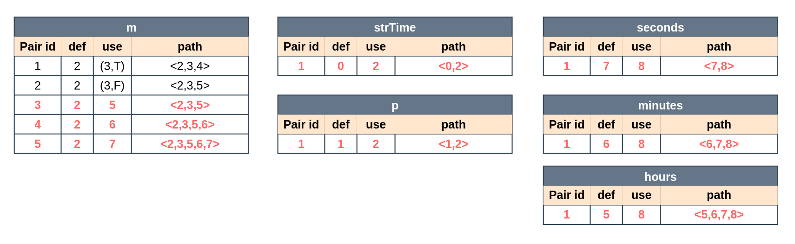
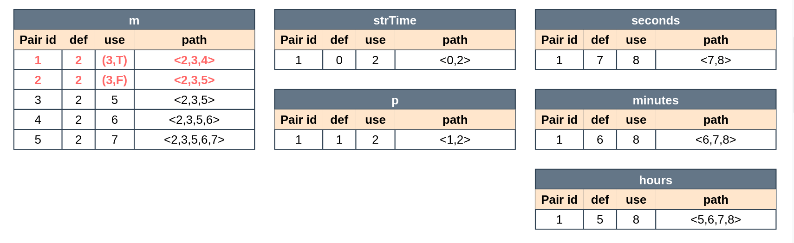

# Assignment 8 - Dataflow Testing

## parseSeconds 

### What is the purpose of this function and why should it be tested ?

This application allows the user to manually change the overall time of a task and the time spent doing that same task in the current day. When that manual configuration is performed, this function is used to convert the input of the user into the correspondent time in seconds, which is then used to update the state of the application. For this reason, it is crucial that this function handles the user input as expected, either by performing the right conversion when possible or by throwing the expected exception. 

### Dataflow Testing

#### Dataflow diagram 


#### Dataflow table


#### All-defs 


#### All-c-uses

    
#### All-p-uses 



#### All-uses 


### Unit Tests and Outcome

#### All-defs 
**m**
- **all_defs::pairId_1**: this test uses the `parseSecondsInvalidTest` created in a previous assignment. This is a `ParameterizedTest`, which receives as argument a value that makes the if condition `true` and passes through the path `<2,3,4>`. The if condition can be checked below: 

  ```java
  if (!m.matches()) throw new ParseException("Invalid seconds-string", 0);
  ```

  Since it returns an `Exception` the test uses an `assertThrows`. The parameters tested can be checked below: 
  ```java
    "",
    "0:07:60",
    "0:90:05",
    "0:6:054",
    "0:007:05",
    "6:54",
    "2",
    "0:07:",
    "0::02",
    ":6:54",
    "2:02:-1",
    "2:-1:05",
    "-1:09:05",
    null
  ```
  In this test, the value of the `strTime` input is changed so that the condition returns true.

  - **Outcome**: fails for null, passes for empty String.

**strTime**
- **all_defs::pairId_1**: To exercise the path `<0,2>`, the `strTime` parameter must be initialized with a valid or invalid argument, as shown above. However, here we are only worried about the first usage of this variable, in node 2, where we must ensure that this input does not cause any undesired effect when creating the `Matcher` instance. In past assignments, we had already made multiple tests: `parseSecondsInvalidBoundariesTest`, `parseSecondsValidBoundariesTest`, `parseSecondsInvalidTest`, and `parseSecondsValidTest` that exercise this path by setting the `strTime` parameter with different values. However, here it would be enough to test it with `null` and with a non-null value (e.g. ""), because the `matcher` function accepts any `CharSequence`, and a `String` variable, which is the case of `strTime`, is also a `CharSequence`. The `parseSecondsInvalidTest` `ParametrizedTest` already tests these cases. In fact, by using an `assertThrows` to check if a `ParseException` is thrown for these invalid values, the outcome of this test shows that the null value generates an unexpected `NullPointerException` instead. To sum up:
  - **Inputs**: null, any String (e.g. empty String);
  - **Outcome**: fails for null, passes for empty String.

**hours**
- **all_defs::pairId_1**: Even though the `hours` variable is only defined in node 5, it is impossible to start executing the function on this node, at least in Java. Therefore, we must ensure that the function reaches this node, which requires that the condition in node 3 evaluates to false i.e., we use a valid time String. In previous assignments, that scenario was already exercised in the `parseSecondsValidTest` and `parseSecondsValidBoundaries`, where different valid values are used and the output time is verified with `assertEquals`. If we were to create a specific test only to test this path, we believe that it would suffice to test a valid time string with only hours, like "24:0:0", so that the return value of node 8 could be accessed only based on the conversion from hours to seconds. To sum up:
  - **Inputs**: "24:0:0" - one of the inputs tested in `parseSecondsValidBoundariesTest`;
  - **Outcome**: success.

**minutes**
- **all_defs::pairId_1**: This case is similar to the previous one. However, it refers to the path `<6,8>`. This path was already exercised in the tests of the earlier assignments where we used valid time Strings as input - `parseSecondsValidTest` and `parseSecondsValidBoundaries`. If we were to create a specific test only to test this path, we believe that it would suffice to test a valid time string with only minutes, like "0:59:0", so that the return value of node 8 could be accessed only based on the conversion from minutes to seconds. To sum up:
  - **Inputs**: "0:59:0" - one of the inputs tested in `parseSecondsValidBoundariesTest`;
  - **Outcome**: success.

**seconds**
- **all_defs::pairId_1**: This case is similar to the previous one. However, it refers to the path `<7,8>`. This path was already exercised in the tests of the earlier assignments where we used valid time Strings as input - `parseSecondsValidTest` and `parseSecondsValidBoundaries`. If we were to create a specific test only to test this path, we believe that it would suffice to test a valid time string with only seconds, like "0:0:59", so that the return value of node 8 could be accessed only based on the seconds' conversion. To sum up:
  - **Inputs**: "0:0:59" - one of the inputs tested in `parseSecondsValidBoundariesTest`;
  - **Outcome**: success.

#### All-c-uses 


**m** 
- **all_c_uses::pairId_3** , **all_c_uses::pairId_4**, **all_c_uses::pairId_5**: these cases follow the respective paths: `<2,3,5>`, `<2,3,5,6>`, `<2,3,5,6,7>`. Since the paths **all_c_uses::pairId_3** and **all_c_uses::pairId_4** are contained in the **all_c_uses::pairId_5**, a test that verifies the path of **pairId_5** will also test the paths of ids 3 and 4. The tests applied were created in a previous assignments, and the input consists of valid strings. Valid strings are the ones that match the regex expression `"%d:%02d:%02d"`. The tests `parseSecondsValidTest` exercises these paths. The inputs are:  

  ```java
  "22:5:48",
  "36:25:8"
  ```
  - **Outcome**: success. 

**strTime**
- **all_c_uses::pairId_1**: Already described in **all_defs::pairId_1** of variable `strTime`.

**hours**
- **all_c_uses::pairId_1**: Already described in **all_defs::pairId_1** of variable `hours`.

**minutes**
- **all_c_uses::pairId_1**: Already described in **all_defs::pairId_1** of variable `minutes`.

**seconds**
- **all_c_uses::pairId_1**: Already described in **all_defs::pairId_1** of variable `seconds`.
  

  
#### All-p-uses 
**m** 
- **all_p_uses::pairId_1**: to test this path, we must have a scenario where the if condition, discussed in the `all-defs` section, is `true`. For this reason, the value of `strTime` must be valid, so that the if condition returns the desired value. Therefore, the test for this section is the same of **all_def::pairId_1**. 
- **all_p_uses::pairId_2**: to test this path, we must have a scenario where the if condition is `false`. In this context, the value of the `strTime` variable must be invalid. For this reason, the tests of this case were developed in the previous assignment in the function test called `parseSecondsInvalidTest`. The values for this test can be checked below: 
  ```java 
  "",
  "0:07:60",
  "0:90:05",
  "0:6:054",
  "0:007:05",
  "6:54",
  "2",
  "0:07:",
  "0::02",
  ":6:54",
  "2:02:-1",
  "2:-1:05",
  "-1:09:05",
  null;
  ```
  - **Outcome**: fails for null, passes for all the other invalid values by throwing the expected exception. 

**strTime**
- **all_p_uses::pairId_1**: `strTime` is not used inside any predicate of a branch, thus there are no p-uses.

**hours**
- **all_p_uses::pairId_1**: `hours` is not used inside any predicate of a branch, thus there are no p-uses.

**minutes**
- **all_p_uses::pairId_1**: `minutes` is not used inside any predicate of a branch, thus there are no p-uses.  

 **seconds**
- **all_p_uses::pairId_1**: `seconds` is not used inside any predicate of a branch, thus there are no p-uses.

#### All-uses 
**m**: All-uses tests are all the possible pairIds. Thus: 
- **all_uses::PairId_1**: uses the test described in **all_defs::pairId_1**; 
- **all_uses::PairId_2**: uses the test described in **all_p_uses::pairId_2**; 
- **all_uses::PairId_3**: uses the test described in **all_c_uses::pairId_3**; 
- **all_uses::PairId_4**: uses the test described in **all_c_uses::pairId_4**; 
- **all_uses::PairId_5**: uses the test described in **all_c_uses::pairId_5**; 

**strTime**
- **all_c_uses::pairId_1**: Already described in **all_defs::pairId_1** of variable `strTime`.

**hours**
- **all_c_uses::pairId_1**: Already described in **all_defs::pairId_1** of variable `hours`.

**minutes**
- **all_c_uses::pairId_1**: Already described in **all_defs::pairId_1** of variable `minutes`.

**seconds**
- **all_c_uses::pairId_1**: Already described in **all_defs::pairId_1** of variable `seconds`.

  
## startXmlElement

### What is the purpose of this function and why should it be tested ?

The `startXmlElement` method of the `ProjectSerializer` class adds a starting element to a `TransformerHandler`, a class that, in the context of this project, is used to parse and build the XML document that stores the state of the application before exiting. This method is used to initialize each XML tag of the configuration file, namely the "projects" tag and the "project" tag of each task. Therefore, it is crucial to ensure that this method does not generate any unexpected behavior. Otherwise, the current tasks and their process may be lost.

#### Dataflow diagram 


### Dataflow table 


### All-defs 


### All-c-uses 

### All-p-uses 


### All-uses 


### Unit Tests
#### All-defs 
**hd**
- **all_defs::pairId_1**: To exercise the path `<0,1,2>`, the JVM must verify the condition inside the function as **true**. In other words, the `atts` parameter passed as an argument to `startXml` must be `null`. Thus, we have reused the test function `startXmlElementNoAtts()` from previous assignments to exercise the path. The `hd` variable is passed to the function as a parameter and contains only one definition. It only needs to be declared with any acceptable value to pass through the path `<0,1,3>`.  

  ```java
  SAXTransformerFactory tf = (SAXTransformerFactory) SAXTransformerFactory.newInstance();
  TransformerHandler hd = tf.newTransformerHandler();
  ``` 

  **Outcome**: The tests passes with success.

**element**
- **all_defs::pairId_1**: To exercise the path `<0,1,3>`, the JVM must verify the condition inside the function is **false**. In other words, the `atts` parameter passed as an argument to `startXml` must be **not** null. Thus, we have reused the test function `public void startXmlElementWithAtts()` from previous assignments to exercise the path. It's in a similar situation to `hd` parameter. 

  **Outcome**: The tests passes with success.

**atts**
- **all_defs::pairId_3**:  To follow the path `<0,1,3>`, the condition `(atts == null)` must be false. Then `atts` 
  must have a value **different from null**. Thus, we have reused the test function `public void startXmlElementWithAtts()` from previous assignments to exercise the path. 

  **Outcome**: The tests passes with success. 

- **all_defs::pairId_4**: This test is similar to **all_defs::pairId_1**. To be declared in node `2`, `atts` must be `null`. Thus, we have reused the test function `public void startXmlElementNoAtts()` from previous assignments to exercise the path. 

  **Outcome**: The tests passes with success. 

#### All-c-uses
To avoid some repetition, this section might reference some tests from the **all-defs** section, since they are the same. 

**hd**
- **all_c_uses::pairId_1**: Uses the test described in **all_defs::pairId_1**. 
**element**: 
- **all_c_uses::pairId_1**: Uses the test described in **all_defs::pairId_1**. 
**atts**: 
- **all_c_uses::pairId_3**: Uses the test described in **all_defs::pairId_3**: 
- **all_c_uses::pairId_4**: Uses the test described in **all_defs::pairId_4**: 


#### All-p-uses
As well as in **All-c-uses** section, this section might reference some tests from the previous sections since they are the same. 

**atts**: 
- **all_c_uses::pairId_1**: For the condition to return **true**, the `atts` must be `null`. Thus, we have reused the test function `public void startXmlElementNoAtts()` from previous assignments to exercise the path. 

  **Outcome**: The tests passes with success.  

- **all_c_uses::pairId_2**: To follow the path `<0,1,3>` the condition `(atts == null)` must be false. In this case, it's necessary to declare the variable and parse it as a parameter to the function. Thus, we have reused the test function `public void startXmlElementWithAtts()` from previous assignments to exercise the path. 
 
  **Outcome**: The tests passes with success.  

#### All-uses

The **All-uses** criteria uses tests from the **All-c-uses** and **All-p-uses**, since, in our case, $all\_p\_uses\cup all\_c\_uses = all\_uses$. 

**hd**
  - **all_c_uses::pairId_1**: Uses the test described in **all_defs::pairId_1**. 
**element**: 
  - **all_c_uses::pairId_1**: Uses the test described in **all_defs::pairId_1**. 
**atts**: 
  - **all_c_uses::pairId_1**: Uses the test described in **all_defs::pairId_1**: 
  - **all_c_uses::pairId_2**: Uses the test described in **all_p_uses::pairId_2** 
  - **all_c_uses::pairId_3**: Uses the test described in **all_defs::pairId_3**: 
  - **all_c_uses::pairId_4**: Uses the test described in **all_defs::pairId_4**: 

> Note: We are aware that the path `<2,3>` is a def-clear path, however, since we can't start executing the code from node 2, the actual execution of the code leads to the exercise of the path `<0,1,2,3>`, which isn't a clear path. Considering the limitations of the Java language, we decided to still test this scenario, even if it doesn't fit the definition of `all-defs`.  

## getSecondsToday 
### What is the purpose of this function and why should it be tested ?
This method of the `Project` class returns the number of seconds spent on a specific task in the current day. This value will be different depending on the current state of the project. For an idle project, this function must return the time previously spent during the present day. However, when considering a running project, the method must also consider the time that is currently passing and constantly being updated.
As this method is essential for presenting the correct time spent on each project to the user, it is crucial to test these different behaviors, which map to distinct paths in the function's implementation.

### Dataflow diagram 


### All-defs 


### All-c-uses 


### All-p-uses 


### All-uses 


### Unit Tests
#### All-defs 
**seconds**:
- **all_defs::pairId_1**: To test this path, the `seconds` variable must be defined, which requires the class attribute `secondsToday` to also be defined, as `seconds` is a copy of `secondsToday`. Furthermore, the condition of node 2 (`isRunning()`) must return true. Thus, the project must be running.
Having this in mind, we must set the `secondsToday` to any integer and the `isRunning` flag to true. 
- **all_defs::pairId_3**: In node 3, the `seconds` variable is redefined and used (added to the result of `getElapsedSeconds`). Even though this is a def-clear path, programmatically, particularly in Java, it is impossible to reach this node without passing nodes 1 and 2. Therefore, to test this path the conditions established for `all_defs::pairId_1` must also hold.

  Considering the impossibility of executing the function from node 3, this two paths were tested together with the `runningGetSecondsTodayTest()`:
  - **Steps**:
    - Create a Project and set it as running - `project.setRunning(true)`; and set the `secondsToday` variable of the class - `setSecondsToday(10)`;
    - By using a spy, make `getElapsedSeconds()` return 5;
    - Call the method `getSecondsToday()`, which will execute node 1, node 2 and, as `isRunning()` is true must go to node 3, where seconds will be incremented;
    - Verifies the final value of seconds by checking the return value with `assertEquals`, which must be 10+5 = 15.
  - **Inputs / Assumptions**: 
    - initial `secondsToday` = 10;
    - `getElapsedSeconds()` returns 5;
    - `isRunning()` returns true.
  - **Outcome**: The test passes successfully.

**secondsToday**:
- **all_defs::pairId_1**: To test this path, the attribute `secondsToday` of the `Project` instance must exist, so that it can be copied to the `seconds` variable. This path was already tested by `runningGetSecondsTodayTest()`.

**e**:
- **all_defs::pairId_1**: Even though <4,5> is a def-clear path, to reach node 4 programmatically, the function needs to also go through nodes 1,2 and 3. Therefore, the conditions to reach node 3 must also hold. Additionally, the `getElapsedSeconds()` method must throw a `ProjectException`. Thus, a different test - `exceptionGetSecondsTodayTest`; was used, where we make the method `getElapsedSeconds()` throw a `ProjectException` by using a spy. The detail about the test are presented below:
  - **Steps**:
    - Create a Project and set it as running - `project.setRunning(true)`; and set the `secondsToday` variable of the class - `setSecondsToday(10)`;
    - By using a spy, make `getElapsedSeconds` throw a `ProjectException`;
    - Call the method `getSecondsToday`, which will execute node 1, node 2 and, as `isRunning()` is true must go to node 3, where the `getElapsedSeconds` must throw an exception, so that the flow will continue to node 4;
    - Verifies the final value of seconds by checking the return value with `assertEquals`, which must be 10;
    - the `fail` method is used inside a catch block so that we ensure that the flow of the program really went through the catch block and that no `ProjectException` was thrown.
  - **Inputs / Assumptions**: 
    - initial `secondsToday` = 10;
    - `getElapsedSeconds()` throws a `ProjectException`;
    - `isRunning()` returns true.
  - **Outcome**: The test passes successfully.

#### All-uses (and All-c-uses) 
As there are no p-uses, the table for the all-uses and all-c-uses is similar.

**seconds**:
- **all_uses::pairId_1**: Already described in **all_defs::pairId_1** of the `seconds` variable.
- **all_uses::pairId_2**: To test this path, the `seconds` variable must be defined, which requires the class attribute `secondsToday` to also be defined. Furthermore, the condition of node 2 (`isRunning`) must return false. Thus, the project must not be running.
Having this in mind, we must set the `secondsToday` to any integer and the `isRunning` flag to false. The return value must be equivalent to the value of `secondsToday`. 
To test this path we used `idleGetSecondsTodayTest`, whose details can be found below:
  - **Steps**:
    - Create a Project and set it as idle - `project.setRunning(false)`; and set the `secondsToday` variable of the class - `setSecondsToday(10)`;
    - Call the method `getSecondsToday`, which will execute node 1, node 2 and, as `isRunning()` is false, must go to node 6;
    - Verifies the final value of seconds by checking the return value with `assertEquals`, which must be 10.
  - **Inputs / Assumptions**: 
    - initial `secondsToday` = 10;
    - `isRunning()` returns false.
  - **Outcome**: The test passes successfully.
- **all_uses::pairId_3**: Already described in **all_defs::pairId_3** of the `seconds` variable.
- **all_uses::pairId_4**: To reach node 3, where `seconds` is redefined, the `seconds` variable must have been created, which requires the class attribute `secondsToday` to also exist. Furthermore, the condition of node 2 (`isRunning`) must return true. Thus, the project must be running. The, the function `getSecondsToday` must not throw an exception, so that it goes directly to the return node 6. This path was implicitly exercised in test `runningGetSecondsTodayTest`, which was already described.

**secondsToday**:
- **all_uses::pairId_1**: Already described in **all_defs::pairId_1** of the `secondsToday` variable.

**e**:
- **all_uses::pairId_1**:  Already described in **all_defs::pairId_1** of the variable `e`.
