# Assignment 9 - Mutation Testing

## Initial Mutation Score

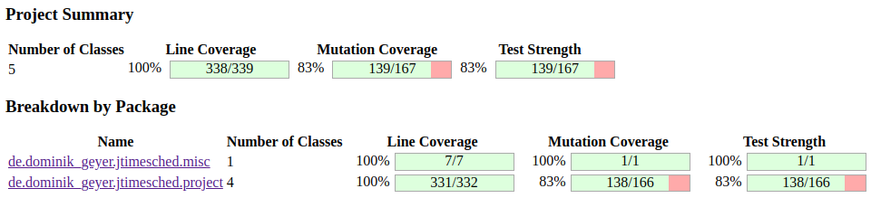
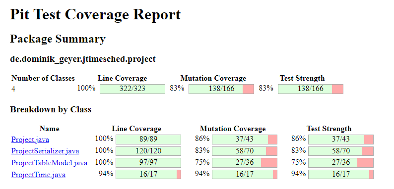
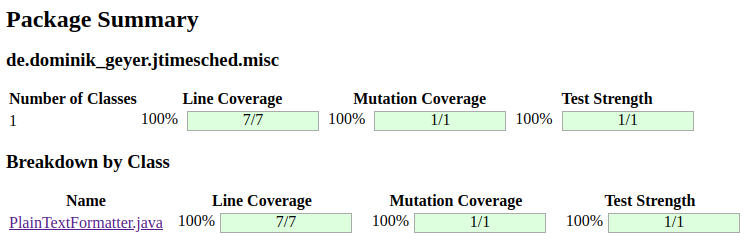
<!-- 
- Adicionalmente dizer que mudamos o codigo de testes anteriores para não shaver testes a falhar?
    - ProjectSerializer :: unnamedElementTest e nullElementTest() :: falhavam porque addXmlElement nao lidava com strings nulas ou vazias no element. Adicionamos um if que verifica isto e dá SAXException se falhar
    - ProjectTime :: parseSecondsInvalidTest :: adicionamos um if para dar throw de ParseException se o parameter for null
    - ProjectTime :: formatSecondsBoundary e formatSecondsPartitionTest :: devolvemos 0:00:00 para numeros negativos
- Explicar porque razão não incluímos os testes e a class JTimeSched 
-->

### Non-killed mutants
<!--Explain which classes have more non-killed mutants --> 

## Irrelevant mutations 

### Project 
The *PiTest* has generated 6 non-killed mutant tests, where 2 of them are not relevant. 

#### Mutant 1 and 2
Before explaining the equivalent mutants, it's important to highlight a possible mutation in the `Project` class is the removal of `e.printStackTrace()` calls. As expected, the tests continues to pass even if this line of code is removed. As the `e.printStackTrace()` is called for debug, log proposals and yet is a java standard function, we decided to ignore this mutation test. 

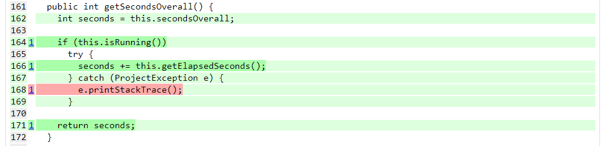 
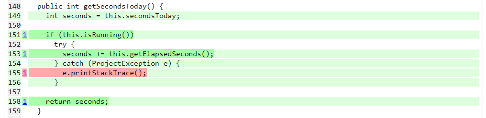 


## Irrelevant mutations 

### Project 

There are 9 mutant that survived the tests developed for the `ProjectSerializer`. Where x of them are irrelevant. 

#### Mutant 1
The `WriteXml()`, contains some non-killed mutant tests. One of them, is related to the `atts.clear()` statement. 

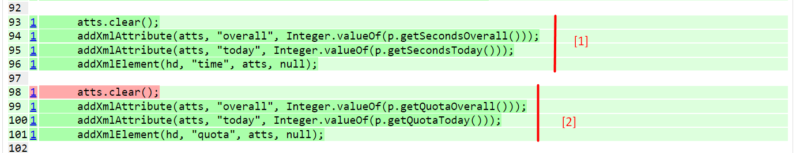 

The `atts.clear()` is responsible for cleaning the list of attributes in a `AttributesImpl` object. However, notice that `[1]` has the same attributes of `[2]`. Although the values of the attributes are different, the `atts.clear()` isn't necessary, since the values of each attribute are replaced by new ones in `[2]`. Thus, there's no way we can change the test code so that the `atts.clear()` becomes necessary. 

#### Mutant 2 
This mutation regards the `WriteXml()` function and excludes the following line from the source code:  

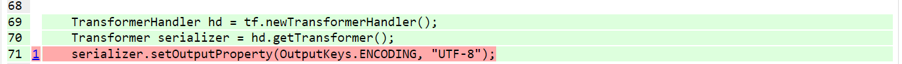 

As the [documentation](https://www.ibm.com/docs/en/sdi/7.1.1?topic=parsers-xml-sax-parser) says, the default enconding for the `XML SAX Parser` is UTF-8, which means that the speficication of the enconding isn't necessary. Thus, there are no changes that could kill the mutation. 

#### Mutant 3 and 4 

The mutation regards the `WriteXml()` function and excludes the following lines from the source code: 

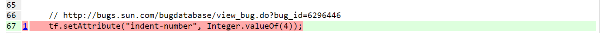
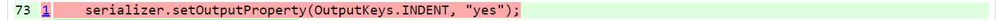 

These statements are responsible for beautifying the output xml text, which means that this is not a critical piece of code and doesn't affect the program execution. Thus, it doesn't make sense testing or verifying it in our test functions. 

#### Mutant 5 
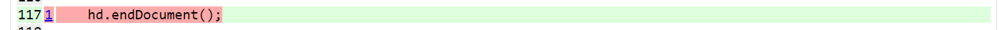 

#### Mutant 6 and 7 
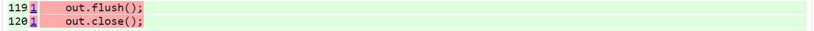 

#### Mutant 8 
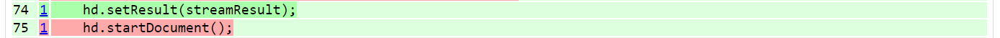 
## Equivalent mutants
<!-- for each class -->

### Project
The *PiTest* has generated 6 non-killed mutant tests. Where 3 of them are equivalent. 

#### Mutant 3,4 and 5

The conditions `if (secondsOverral < 0)` and `if (secondsToday < 0)`  in the functions `setSecondsOverral`, `setSecondsToday` and `adjustSecondsToday` fails the mutations test, by surviving, when the conditions boundary is changed. 
However, changing the `<` for ` <=` is an equivalent mutant, since it behaves as the original program and it's expected and will not be treated. 

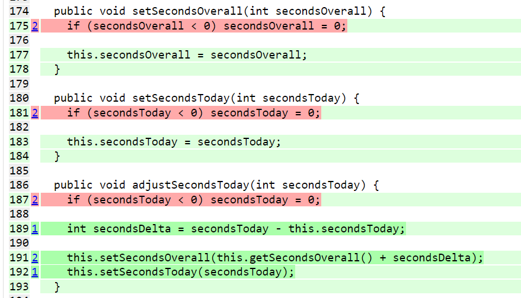


### ProjectTime

### ProjectTableModel

### ProjectSerializer

### PlainTextFormatter

## Description of the tests 

###  Project 
There are 6 mutants that survived the tests developed for the `Project` class in the `getElapsedSeconds` method. 

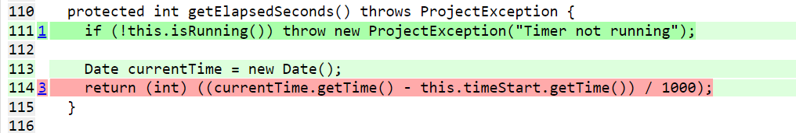

The *PiTest* mutates `getElapsedSeconds` by **replacing the return condition for 0 (zero)**. 

In fact, the test created to verify this method (`runningElapsedSecondsTest()`) expects that it returns a zero value, since the `timeStart` is not set and its default value is 0 (zero) as well: 

```java
  @Test
  public void runningElapsedSecondsTest() {
    // Given
    Project project = new Project();
    project.setRunning(true);
    // When and Then
    try {
      Assertions.assertEquals(0, project.getElapsedSeconds());
    } catch (ProjectException e) {
      fail("Exception shouldn't be thrown");
    }
  }
```

Thus, we have set a value for the `startTime` variable which is equivalent of three days before the test execution: 

```java
@Test
public void runningElapsedSecondsTest() {
    // Given
+   long DAY_IN_MS = 1000 * 60 * 60 * 24;
    Project project = new Project();
    project.setRunning(true);
+   project.setTimeStart(
+       new Date(System.currentTimeMillis() - (3 * DAY_IN_MS)));
    // When and Then
    try {
+       Assertions.assertEquals(259200, project.getElapsedSeconds());
-       Assertions.assertEquals(0, project.getElapsedSeconds());
    } catch (ProjectException e) {
        fail("Exception shouldn't be thrown");
    }
}
```

On this way, the test is always expecting to have `259200` as return value and passes the mutation test.   

**Preconditions**:   
- The project is running;   
- The project has the `TimeStart` of 3 days.    

**Inputs**: None  
**Outcome**:   The tests pass sucecssfully and the mutant is killed. 

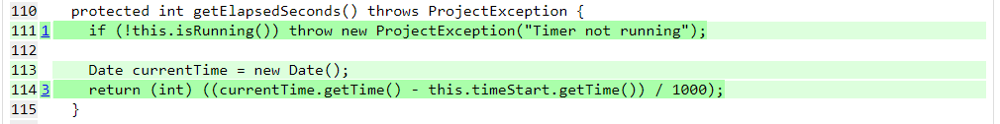 

### ProjectTime 

### ProjectTableModel 

### ProjectSerializer 
There are 9 mutant that survived the tests developed for the `ProjectSerializer`. 

#### Mutant 9 

In the function `readXml()`, although the `set` statments are removed from the function, the test still passes: 

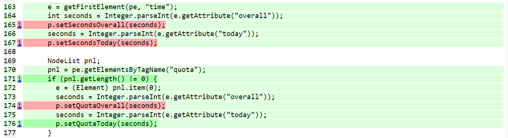

Since the test `readXml_1()` and `readXml_2()` only assess default values, the value of the variables `secondsOverall`, `secondsToday` and `quoteOverall` of a project (the `p` variable) will be correct even if the sets are removed. 

Thus, the `readXml_2()` test was changed so that value read from the xml file isn't the default one. This was done performing the following assertions:

```java
Assertions.assertEquals(600, projectList.get(1).getQuotaToday());
Assertions.assertEquals(10, projectList.get(1).getSecondsOverall());
Assertions.assertEquals(10, projectList.get(1).getSecondsToday());
```

And consequently modifing the second project in the Xml input to:

```xml
<project>
    <title>New project</title>
    <notes>A nice note</notes>
    <created>1668006000250</created>
    <started>1668006000250</started>
    <running>no</running>
    <checked>yes</checked>
    <time overall="10" today="10"/>
    <quota overall="800" today="600"/>
    <color red="122" green="194" blue="229" alpha="255"/>
</project>
```

**Inputs**: the project XML filepath `"docs/05_assignment/inputDir/projectTest"`   
**Outcome**: The test pass successfully and the mutant is killed.  

With this modifications, the mutant tests are killed.

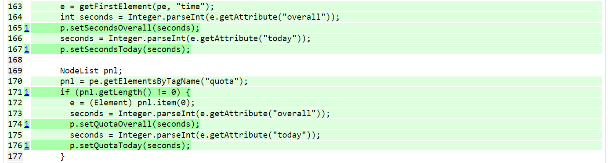 
___ 


### PlainTextFormatter 
