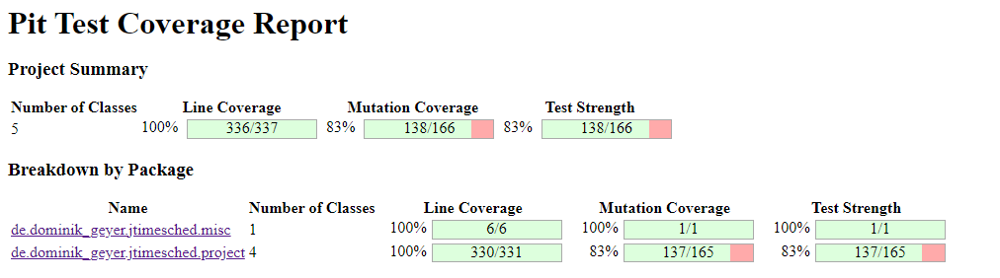

# Assignment 9 - Mutation Testing

## Initial Mutation Score

<!-- 
- Adicionalmente dizer que mudamos o codigo de testes anteriores para não shaver testes a falhar?
    - ProjectSerializer :: unnamedElementTest e nullElementTest() :: falhavam porque addXmlElement nao lidava com strings nulas ou vazias no element. Adicionamos um if que verifica isto e dá SAXException se falhar
    - ProjectTime :: parseSecondsInvalidTest :: adicionamos um if para dar throw de ParseException se o parameter for null
    - ProjectTime :: formatSecondsBoundary e formatSecondsPartitionTest :: devolvemos 0:00:00 para numeros negativos
- Explicar porque razão não incluímos os testes e a class JTimeSched 
-->

### Non-killed mutants
<!--Explain which classes have more non-killed mutants -->

## Equivalent mutants
<!-- for each class -->

### Project

### ProjectTime

### ProjectTableModel

### ProjectSerializer

### PlainTextFormatter

## Description of the tests 

###  Project 

### ProjectTime 

### ProjectTableModel 

### ProjectSerializer 

### PlainTextFormatter 