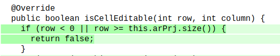

# Assignment 9 - Mutation Testing

## Setup

In order to perform mutation testing in JTimeSched using the PIT library it was necessary to adapt our test suite, in particular to:
- update the source code to make sure that all the tests developed in previous assignments successfully passed;
- exclude tests that exercise the main function of the project, because, even though they run successfully in previous assignments, they are not supported by the PIT library - probably because they require the application to be launched.

With this in mind, we started by updating the source code of some of the functions that failed under certain conditions. Namely:
- `addXmlElement`: this function did not handle null and empty strings in the `element` attribute correctly, which was leading the `unnamedElementTest` and `nullElementTest` to fail. In order for this tests to pass, we added a condition to `adXmlElement` that verifies these scenarios and throws a `SAXException` if they occur;
- `parseSeconds`: this method led the `parseSecondsInvalidTest` to fail because it did not throw a `ParseException` when a null string was passed as parameter. We added an if statement that verifies this scenario and throws the appropriate exception when it occurs;
- `formatSeconds`: the `formatSecondsBoundary` and `formatSecondsPartitionTest` were failing when the parameter was a negative number because the `formatSeconds` method did not handle negative numbers correctly. Therefore, we added a condition that checks if the parameter is lower than 0 and returns "0:00:00" if that is the case;
- `isCellEditable`: tests `testPartitionE7` and `testPartitionE9` were failing because the function `isCellEditable` did not handle case where the project row parameter was out of bounds. To fix this, we now verify if the row is smaller than 0 or higher or equal to the number of project in the table and return `false` if that is the case.


Having all previous tests successfully passing, we then set up the `pitest` configuration.
First, we excluded the `JTimeSchedAppTest` from the test classes, so that the `testConfFolder` test is not executed. We also decided to exclude the class `JTimeSchedApp` from mutation because, apart from the main function (which launches the App and thus is not testable with PIT library), the lack of dependency injection i.e. most of the variables are created inside the function instead of being provided in the parameters; and the usage of private methods and the calls to static functions make it extremely hard to test with unit tests. Moreover, we excluded the classes of the `gui` package from mutation as well. The `excludedClasses`and `excludedTestClasses` of the excerpt of the pom.xml file reflect these decisions.

```xml
<plugin>
  <groupId>org.pitest</groupId>
  <artifactId>pitest-maven</artifactId>
  <version>1.10.0</version>
    <configuration>
      <excludedClasses>
        <param>de.dominik_geyer.jtimesched.gui.*</param>
        <param>de.dominik_geyer.jtimesched.gui.table.*</param>
        <param>de.dominik_geyer.jtimesched.JTimeSchedApp*</param>
      </excludedClasses>
      <excludedTestClasses>
        <param>de.dominik_geyer.jtimesched.JTimeSchedAppTest</param>
      </excludedTestClasses>
    </configuration>
    ...
</plugin>  
```

## Initial Mutation Score

The initial report shows a mutation coverage of 82% and a test strength of 83%. 


Additionally, if we analyze the mutation coverage for each package individually we verify that the `misc` package has 100% line and mutation coverage and test strength. Therefore, we will focus on improving the mutation score for the `project` package.


Breaking down the coverage by class, we see that the mutation score of the classes varies from 75% (`ProjectTableModel`) and 94% (`ProjectTime`), which means that there are still non-killed mutants to be addressed. However, as we will see, not all the reported mutants should be considered (there are some equivalent mutants).


### Non-killed mutants
The class with more non-killed mutants is therefore the `ProjectSerializer`, with 12/70 mutants that survive the tests developed in previous assignments. However, it is also the class for which more mutations were generated. Moreover, 9/36 mutants survive the tests developed for the methods of the `ProjectTableModel` class and 6/43 mutations survive the unit tests developed for the `Project` class. Finally, only 1 mutant resists the tests developed for the methods of the `ProjectTime` class.

Some of these mutants are, however, equivalent, as we will see in the [next section](#equivalent-mutants). The other non-killed mutants and the tests developed to handle them will be further explained in the scope of each class in the [Description of the tests](#description-of-the-tests) section of this report.

## Equivalent mutants
<!-- for each class -->

### Project

### ProjectTime

### ProjectTableModel

### ProjectSerializer

### PlainTextFormatter

## Description of the tests 

###  Project 

### ProjectTime 

### ProjectTableModel 
There are 9 mutants that survive the tests developed for the `ProjectTableModel` class:


#### Mutant 1
The first mutant was introduced function when we fixed the source code of the `isCellEditable` method to avoid failing tests:


**Mutation**: `replaced boolean return with true for de/dominik_geyer/jtimesched/project/ProjectTableModel::isCellEditable`

This mutant replaced the boolean return by `true` and still managed to survive the existent tests. Therefore, we improved the `testPartitionE7` and `testPartitionE9` parameterized tests to verify that the method returns false when the row index is out of bounds. For that, we used the `testRowParameter` function, which uses the `assertEquals` to verify if the given row leads to a "false" return value.
**Preconditions**:
- The project table model has a single project.
**Inputs**:
- **`testPartitionE7`**: -2, -1;
- **`testPartitionE9`**: 1, 2.
**Outcome**
- The tests pass successfully and the mutant is killed:


#### Mutant 2


**Mutation**: `setValueAt : negated conditional → KILLED`

This mutant shows that the condition that verifies if the project is checked or not is not exercise. Therefore, we had to find a way to verify the output of logger when the `setValueAt` function is called to set the value of the `ProjectTableMode.COLUMN_CHECK` as true or false.
 For that, we created the tests `testCheckProject` and `testUncheckProject`. Furthermore, to be able to test the output of the logger, we created a custom `Handler` that stores the last message that is published to the logger in a class field:
 ```java
class LogHandler extends Handler {
  private String lastMessage = "";

  public String getMessage() {
    return lastMessage;
  }

  public void close() {}

  public void flush() {}

  @Override
  public void publish(LogRecord record) {
    lastMessage = record.getMessage();
  }
}
 ```
Then, in each of the tests, we associate the handler with the logger `l`, which was already initialized in the function annotated with `@BeforeEach`, namely `initProjectTableModel` (explained in assignment 5):
```java
    LogHandler handler = new LogHandler();
    l.addHandler(handler);
    l.setLevel(Level.INFO);
```
The `initProjectTableModel` also initializes the `ProjectTableModel` instance with a single project. After that, in each of the tests, we set the parameter `row` to 0 (the first and only project of the Table), the `col` to `ProjectTableModel.COLUMN_CHECK` and the value to `true` or `false`, to check or uncheck the checkbox of that table cell. After calling the `setValueAt` function with this parameters we then assert that the output of the logger is the expected:
```java
// In testCheckProject
String expected = "Set check for project 'project'";
Assertions.assertEquals(expected, handler.getMessage());

// In testUncheckProject
String expected = "Unset check for project 'project'";
Assertions.assertEquals(expected, handler.getMessage());
```

**Preconditions**:
- The project table model has a single project.
**Inputs**:
- **`testCheckProject`**: 
  - `value` = `true`;
  - `row` = 0;
  - `col` = `ProjectTableModel.COLUMN_CHECK`. 
- **`testUncheckProject`**: 
  - `value` = `false`;
  - `row` = 0;
  - `col` = `ProjectTableModel.COLUMN_CHECK`. 
**Outcome**
- The tests pass successfully and the mutant is killed:


#### Mutants 3 & 4
.

**Mutations**: `setValueAt : negated conditional → KILLED` (both mutations are of the same type)

This mutants show that our test suit was lacking a test to verify the log generated when the method `setValueAt` is used to update the value of the `ProjectTableModel.COLUMN_TIMETODAY` or `ProjectTableModel.COLUMN_TIMEOVERALL`. When one of these columns is edited, the `oldSeconds` variable is used in the function to store the previous value of the respective attribute (`secondsToday` or `secondsOverall`) so that the log shows what was the old value and what is the new one. To test if the output was the expected when the `ProjectTableModel.COLUMN_TIMETODAY` we used the test `testSetTimeTodayColumn`. To test the other column we used the test `testSetTimeOverallColumn`.

In both tests we start by setting the `LogHandler` as described in the previous tests. Then, we set `secondsOverall` and `secondsToday` class properties of the only project of the `ProjectTableModel`(initialized in `initProjectTableModel`). We used different values for each property so that we could easily verify the old value outputted in the log. We called the `setValueAt` method with the inputs described below and asserted that the log matched what was expected:
```java
// testSetTimeOverall
 String expected = "Manually set time overall for project 'project' from 0:00:10 to 0:00:15";
    Assertions.assertEquals(expected, handler.getMessage());

// testSetTimeToday
String expected =
        "Manually set time today for project 'project' from 0:00:05 to 0:00:15";
Assertions.assertEquals(expected, handler.getMessage());
```

**Preconditions**:
- The project table model has a single project with `secondsOverall` = 10 and `secondsToday` = 5.
**Inputs**:
- **`testSetTimeTodayColumn`**: 
  - `value` = 15;
  - `row` = 0;
  - `col` = `ProjectTableModel.COLUMN_TIMETODAY`. 
- **`testSetTimeOverallColumn`**: 
  - `value` = 15;
  - `row` = 0;
  - `col` = `ProjectTableModel.COLUMN_TIMEOVERALL`. 
**Outcome**
- The tests pass successfully and the mutants are both killed:


#### Mutant 5 to 7
<!-- na addProject -->

#### Mutant 8
<!--na removeProject -->

## Mutant 9
<!-- call tah fireTable no fim da setValueAt -->

### ProjectSerializer 

### PlainTextFormatter 